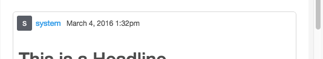
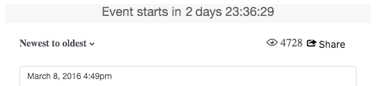
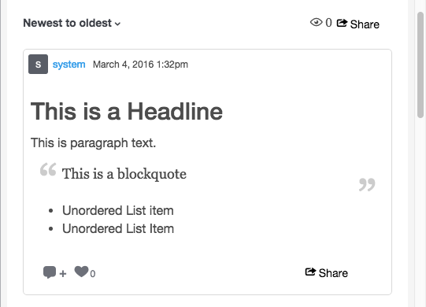
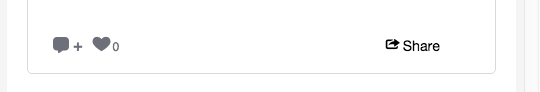

# CSSクラスの保存{#storify-css-classes}

Storify Appsで使用できるCSSクラス。

CSSを使用してStorify Appsをカスタマイズし、ページとの統合をより完全に行うには、独自のスタイルシートで初期設定のCSSを上書きします。 この節では、使用可能なCSSのカスタマイズについて説明します。

## 作成者要素{#section_tdy_hsh_xz}

投稿の発言者のアバター、発言者名、タイムスタンプのスタイル設定をカスタマイズできます。

| クラス | 説明 |
|---|---|
| .s-author-name | 作成者 |
| .s-author-avatar | 発言者のアバター。 |
| .s-img | 発言者のアバター画像。 |
| .s-timestamp | 投稿された日付コンテンツのタイムスタンプ。 |

## ヘッダー要素{#section_nbv_gsh_xz}

ストーリーページのヘッダーセクションをカスタマイズできます。

| **クラス** | **説明** |
|---|---|
| .super-header | メインヘッダー |
| .outer-header | メインヘッダー行1 |
| .s-countdown | メインヘッダー行1カウントダウンタイマー |
| .s.liveness | メインヘッダー行1の「ライブ」ステータス |
| .base-header | メインヘッダー行2 |
| .s-dropdown | メインヘッダー行2並べ替えドロップダウントリガー |
| .s-dropdown-menu | メインヘッダー行2並べ替えドロップダウンメニュー |
| .s-dropdown-triangle | メインヘッダー行2並べ替えドロップダウンメニューキャレット。 |
| .s-dropdown-option | メインヘッダー行2並べ替えドロップダウンメニュー項目 |
| .s-表示 | メインヘッダー行2の表示数。 |
| .s-share-button | メインヘッダー行2 「共有」ボタン。 |
| .s-share-menu | メインヘッダー行2共有メニュー。 |

## 投稿要素{#section_lrs_fsh_xz}

投稿のストーリー要素のスタイル設定をカスタマイズできます。

| **クラス** | **説明** |
|---|---|
| .s-liveblog | Story要素全体のコンテナ |
| .s-post | 投稿コンテナ |
| .s-modal-content | ポストモーダルコンテナ |
| .s-element-content | 投稿内のすべてのコンテンツ要素 |
| .s-element-text ul | テキスト要素 |
| .s-element-text h2 | テキスト要素の見出し |
| .s-element-text p | テキスト要素の段落 |
| .s-element-text ul | テキスト要素の順不同リスト |
| .s-element-text ol | テキスト要素の順序付きリスト |
| .s-element-text li | テキスト要素のリスト項目 |
| .s-element-text blockquote | Blockquote |
| .s-element-text blockquote:before | ブロック引用の先頭のアイコン |
| .s-element-text blockquote:after | ブロック引用符の終わりのアイコン |
| .s-element-image | インライン画像要素のコンテナ |
| .s-img | `` element |
| .s-image-caption | ソーシャルメディア上の画像とビデオのキャプション(例：Instagram像) |
| .s-upload-image-caption | ストーリーエディターでアップロードした画像およびビデオのキャプション。 |
| .s-element-video | ビデオ要素 |
| .s-element-quote | 見積もり要素(例：ツイート（テキストのみ） |
| .s-element-quote-image | イメージ要素を含む引用(例：画像を含むツイート) |
| .s-element-quote-video | ビデオ要素を含む見積もり(例：ビデオを含むツイート) |
| .s-link-body | 見積もり内のリンクプレビュー(例：リンクプレビューを含むツイート) |

## フッター要素{#section_ozc_zrh_xz}

個々の投稿のフッターセクションをカスタマイズできます。

| **クラス** | **説明** |
|---|---|
| .s-post-footer | 投稿のフッター。 |
| .s-sidenots | 投稿のフッターにある「サイト」ボタン。 |
| .sに似た | 投稿のフッターにある「いいね！」ボタン。 |
