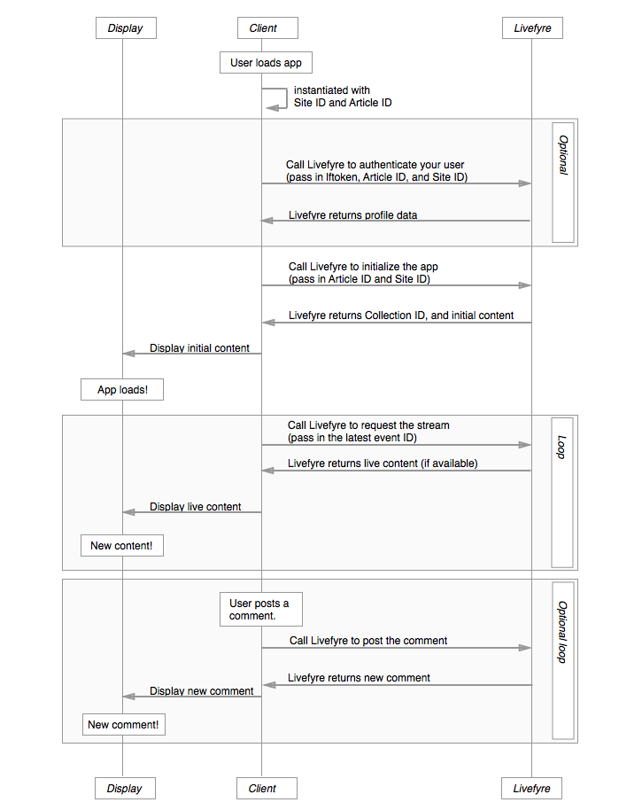

# アーキテクチャ{#architecture}

Livefyreの規則とLivefyreがコンテンツを編成する方法について説明します。

この節では、Livefyreネットワークアーキテクチャの概要を説明します。

## ネットワークとサイトの概要

Livefyreは、ユーザーとコンテンツをネットワークとサイト別に整理します。 各ネットワークには、1つ以上のユーザーアカウントが関連付けられている場合があり、各ネットワークには1つ以上のLivefyreサイトが含まれている場合があります。 Livefyreサイトは、コレクションを任意にグループ化したものです。 1つのコレクションは、CMS内の1つの記事IDに対応付けられます。

## ネットワークについて{#section_hqt_4m4_xz}

複数のドメインを持つユーザーは、単一のLivefyreネットワークを使用して、すべてのドメインでユーザーアカウントを共有できます。 異なるドメインに対して別々のユーザーアカウントを保持したい顧客は、別々のLivefyreネットワークが必要になります。

構成設定は、サイト、ネットワーク、コレクション（上の図では会話と呼ばれます）に適用できます。

>[!NOTE]
>
>一部の設定は、ネットワークレベルでのみ使用できます（電子メール通知の環境設定、電子メールの送信者アドレス、電子メールのカスタムロゴなど）。 これらの設定をドメインごとに異ならせる場合は、複数のネットワークを使用する必要があります。

## サイトについて{#section_vjw_nm4_xz}

サイトは、記事を任意にグループ化したものです。 このグループは、異なるモデレーターを異なるコンテンツのグループに割り当てることができるので、便利です。 モデレーターと所有者は、コンテンツをモデレートするように設定し、ネットワークレベルまたはサイトレベルで管理者設定を構成できます。 一部のモデレーターに特定のコレクションのみを表示させたい場合、これらのコレクションが別のLivefyreサイトとして設定されている可能性があります。

>[!NOTE]
>
>カスタムネットワーク下のサイト数に制限はありません。

## アプリシーケンス図{#section_mw2_lm4_xz}

Livefyreが提供するエンドポイントを使用したカスタム関数の実装を希望する場合でも、単に問題のデバッグを必要とする場合でも、Livefyreアプリのリクエスト/応答フローの動作を理解するのに役立ちます。

1. クライアントがサイトをヒットした場合は、サイトIDと記事IDを使用してLivefyreアプリをインスタンス化します。
1. ユーザーを認証する（トラフィック評価やサイト保護に役立つ）場合は、サイト情報をLivefyreに送信し、ユーザープロファイルトークンを送信します。
1. サイトIDと記事IDをLivefyreに送信して、アプリを初期化します。

   Livefyreは初期コンテンツを返します。

   このコンテンツをページに送信し、アプリを表示します。

1. ページに表示されるコンテンツを更新するには、ページから最新のイベントIDをLivefyreに送信します。 新しいコンテンツが存在する場合は、そのコンテンツが返されます。

   新しいコンテンツを含むページを再読み込みし、無期限にプロセスを繰り返します。

1. ユーザーが新しいコンテンツを投稿できるようにする場合は、サイトに新しいコンテンツが投稿されたときにイベントをトリガーして、Livefyreにコンテンツを投稿します。 Livefyreは更新されたストリームを返し、これを使用してサイトの更新を行うことができます。
