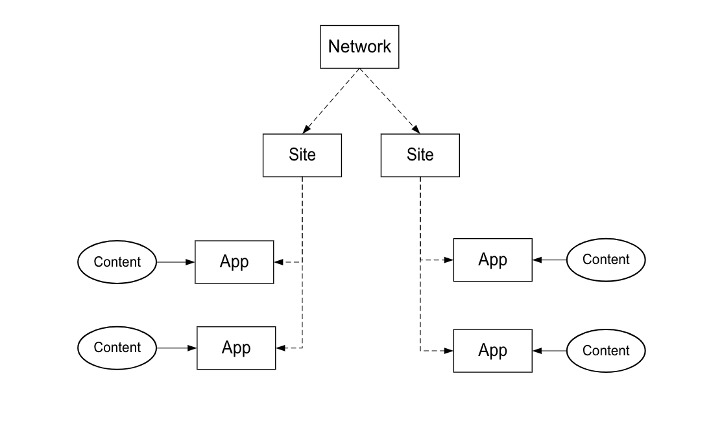

# 実装プロセス{#implementation-process}

Livefyreの実装に要する時間は、実装と作業範囲によって異なります。

## Livefyreネットワークアーキテクチャの概要 {#section_dgj_l32_rbb}

Livefyreでは、ネットワークアーキテクチャについて次の用語を使用します。

* ネットワーク. Livefyreの使用を予定している最上位ドメイン。
* Sites. ネットワークの一部であるサブドメインまたはサイトセクション。
* アプリ. サイト上のコンテンツのレンダリング。 コンテンツは、ビジュアライゼーションアプリ（Mosaic、カルーセル、Feature Cardなど）を使用して、アプリに視覚的に表示されます。またはテキスト形式で、会話アプリ（コメント、レビュー、チャットなど）を使用します。 1つ以上のアプリをサイトに配置できます。
* ストリーム。 ストリームとは、ソーシャルメディアや他のサイトを検索して、アプリでモデレートや直接投稿のためにコンテンツを自動的に収集するフィルターです。
* コンテンツ（UGC、コメントなど）。 アプリに表示する内容。 コンテンツには、ビジュアル（例えば、写真やビデオ）、オーディオのみ、テキストを使用できます。

次の図に、ネットワーク、サイト、アプリ、コンテンツの関係を示します。

独自のLivefyreインスタンスがあり、これはコンテンツのモデレートやユーザーの管理などのための中央のダッシュボードです。 Livefyreインスタンスにアクセスするには、CSMに問い合わせてください。

## 統合手順 {#section_s2j_d2x_tz}

Livefyreを統合する主な手順は3つあります。

* アプリの統合

   Livefyreを実装する場合、実装のスタイルは使用事例によって異なります。 を参 [照してください](/help/implementation/c-getting-started/c-implementation-process/c-app-integration-types.md#c_app_integration_types)。

* 認証統合

   会話アプリや、サイトでエンドユーザー認証を必要とする他のアプリ用に、既存のユーザー管理システムをLivefyreと統合する必要があります。 現在ユーザー管理ツールを使用していない場合は、Livefyre IDを使用できます。 Livefyre ID [とは何ですか、設定方法について詳しくは](/help/implementation/c-livefyre-identity-comp/c-livefyre-identity-comp.md#c_livefyre_identity)、

* カスタマイズ

   カスタマイズはオプションですが、ほとんどのお客様はブランドに合わせてアプリをカスタマイズします。

