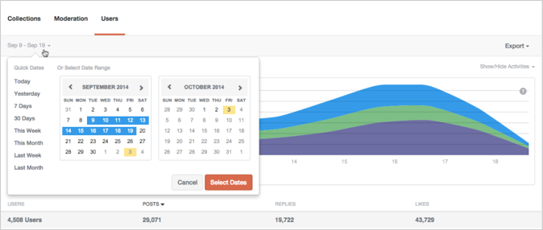
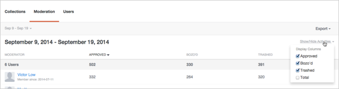
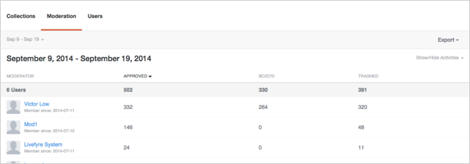
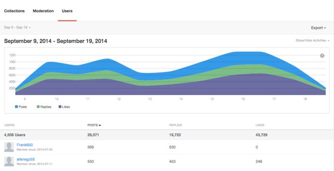

# Analytics{#analytics}

サイトのユーザー、コンテンツおよびモデレーターアクティビティを分析します。

## Analytics {#topic_22D8FAE581CD440EA02B1595520F60C2}

サイトのユーザー、コンテンツおよびモデレーターアクティビティを分析します。

Livefyre Analyticsでは、「会話」、「モデレート」および「ユーザー」データのダッシュボードを読みやすくして、ネットワークデータにアクセスできます。これらのダッシュボードを使用して、アクティビティを監視し、サイト上のクイック分析を実行します。

ダッシュボードは、サイト、日付、アクティビティでフィルタできます。ウィンドウの左上にあるネットワークプルダウンを使用して、表示するサイトを選択します。生成された列ヘッダーをクリックすると、任意のデータポイントについての詳細情報が表示されます。

このページでは、以下について説明します。

* ダッシュボードの [日付範囲](https://answers.livefyre.com/livefyre-studio-version-1/studio/analytics/#DateRange) の選択
* [使用可能なアクティビティの表示/非表示](https://answers.livefyre.com/livefyre-studio-version-1/studio/analytics/#ShowHideActivities)
* [ダッシュボードデータのエクスポート](https://answers.livefyre.com/livefyre-studio-version-1/studio/analytics/#ExportDashboardData)
* [コレクションダッシュボード](https://answers.livefyre.com/livefyre-studio-version-1/studio/analytics/#CollectionsDashboard)
* [モデレートダッシュボード](https://answers.livefyre.com/livefyre-studio-version-1/studio/analytics/#ModerationDashboard)
* [ユーザーダッシュボード](https://answers.livefyre.com/livefyre-studio-version-1/studio/analytics/#UsersDashboard)

>[!NOTE]
>
>現在、AnalyticsはLivefyre Coreアプリケーションとモデレートからのアクティビティをサポートしています。これらのダッシュボードに含まれるほとんどのアクティビティは、Livefyre JavaScriptイベントから [も利用できます。これらのイベント](https://answers.livefyre.com/developers/reference/app-customizations/javascript-events/)は、独自のカスタムまたはサードパーティの分析ツールの電源を作成するために使用できます。

## 日付範囲 {#concept_798C438120E643B6BE262C9997DC87C4}

表示する日付のプルダウンをクリックして、表示する範囲を選択します。クイック日付を使用するか、提供されたカレンダーから開始日と終了日を選択します。

クイック日付:

* **今日:** 現在の時刻までの午前零時（この時刻までの最後の完全な時間まで）のデータを表示します。
* **昨日:** 24時間前のデータを表示します。
* **7日:** 今日のデータを含まない、過去7日間のデータを表示します。
* **30日:** 今日のデータを含まない、過去30日間のデータを表示します。
* **今週:** 最後の完了時間までの午前0時（最後の完全な時間まで）のデータを表示します。
* **今月:** 現在の月の最後の完全な時間まで、現在の月の初日までの午前零時のデータを表示します。
* **先週:** 先週のデータを表示します。
* **先月:** 先月のデータを表示します。

## アクティビティの表示/非表示 {#concept_022D9851CBCE4A2FB80D0AE52A23744D}

アクティビティとは、コメント、フラグ付け、共有、モデレートなど、サイトでユーザーが行うアクションです。[アクティビティの **表示/非表示** ]プルダウンを使用して、ダッシュボードに含めるアクティビティを選択します。

>[!NOTE]
>
>フィルターの新しいイベントを選択すると、URLを変更せずにページが再レンダリングされます。

使用可能なアクティビティは、ダッシュボードのタイプとエクスポートによって異なり、次のようなものがあります。

* **投稿:** 現在の時刻までの午前零時（この時刻までの最後の完全な時間まで）のデータを表示します。
* **返信:** 24時間前のデータを表示します。
* **いいね!:** 今日のデータを含まない、過去7日間のデータを表示します。
* **Unlike Unlike:** 今日のデータを含まない、過去30日間のデータを表示します。
* **メディアを含む:** 最後の完了時間までの午前0時（最後の完全な時間まで）のデータを表示します。
* **投稿の写真アップロード:** 現在の月の最後の完全な時間まで、現在の月の初日までの午前零時のデータを表示します。
* **投稿にリンクがあります:** 先週のデータを表示します。
* **投稿に@メンションがあります:** 先月のデータを表示します。
* **承認済み:** 先月のデータを表示します。
* **Bozo&#39;d:** 先月のデータを表示します。
* **Trashed:** 先月のデータを表示します。
* **モデレート合計:** 先月のデータを表示します。

## ダッシュボードデータのエクスポート {#concept_730DB61A9F894BE6BFB34E0E2A421ED3}

エクスポート **** プルダウンメニューを使用して、ダッシュボードデータをCSVファイルとしてエクスポートします。

* Daily Digest（コレクションのみ）:では、最終完了日の毎日の集計が各コレクションにエクスポートされます。
* 表データ:すべてのロールアップコレクションデータ（すべての列と現在のレポートの行）をエクスポートします。
* 生データ:により、現在のロールアップレポートの作成に使用された個々のイベントがエクスポートされます。

>[!NOTE]
>
>これらのレポートのエクスポートには数分かかる場合があります。すべてのタイムスタンプはUnix時間です。

## コレクション {#concept_228D8E5553784DB8BABF3819A5FF0345}

コレクションダッシュボードには、コレクション別にユーザーアクティビティが一覧表示され、最も多くの（および少ない）コンテンツを指定できます。リストに表示される各コレクションには、そのページが検出されたページへのリンクが含まれます。

## モデレート {#concept_98689B1E804B43CEA21E3F456107CCD9}

モデレートダッシュボードにはモデレーターによってイベントが一覧表示され、アクティビティを評価できます。このレポートを使用して、最もアクティブなモデレーターと最も一般的なモデレート操作を見つけます。

>[!NOTE]
>
>モデレーター名LivefyreシステムのLivefyreモデレートアクティビティが一覧表示されます。

## ユーザー {#concept_D1A83E31C7B5467F9C844CBF9A740E12}

ユーザーダッシュボードには、ユーザーごとのサイトアクティビティが表示されます。これにより、個々のユーザーがどのようにサイトを操作しているかを分析できます。このダッシュボードを使用して、サイト全体で最もアクティブなユーザを見つけ、最も人気のあるサイトアクティビティを評価します。

