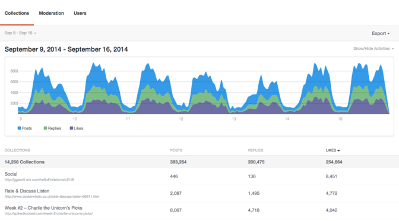

# Analytics{#analytics}

サイトのユーザー、コンテンツおよびモデレーターのアクティビティを分析します。

## Analytics {#topic_22D8FAE581CD440EA02B1595520F60C2}

サイトのユーザー、コンテンツおよびモデレーターのアクティビティを分析します。

Livefyre Analyticsでは、会話、モデレート、ユーザーの各データに関するダッシュボードを読みやすい形で、ネットワークデータにアクセスできます。 これらのダッシュボードを使用して、アクティビティを監視し、サイトで迅速な分析を実行します。

ダッシュボードは、サイト、日付、アクティビティでフィルタできます。 ウィンドウの左上にある[ネットワーク]プルダウンを使用して、表示するサイトを選択します。 生成後は、列見出しをクリックして並べ替えるか、グラフ上にマウスを移動して、任意のデータポイントに関する詳細な情報を表示します。

このページでは、次の内容について説明します。

* ダッシュボードの[日付範囲](https://answers.livefyre.com/livefyre-studio-version-1/studio/analytics/#DateRange)の選択
* [使用可能なアクティビティの表示/非表示](https://answers.livefyre.com/livefyre-studio-version-1/studio/analytics/#ShowHideActivities)
* [ダッシュボードデータの書き出し](https://answers.livefyre.com/livefyre-studio-version-1/studio/analytics/#ExportDashboardData)
* [コレクションダッシュボード](https://answers.livefyre.com/livefyre-studio-version-1/studio/analytics/#CollectionsDashboard)
* [モデレートダッシュボード](https://answers.livefyre.com/livefyre-studio-version-1/studio/analytics/#ModerationDashboard)
* [ユーザーダッシュボード](https://answers.livefyre.com/livefyre-studio-version-1/studio/analytics/#UsersDashboard)

>[!NOTE]
>
>解析では、現在、Livefyreコアアプリケーションおよびモデレートからのアクティビティをサポートしています。 これらのダッシュボードに含まれるほとんどのアクティビティは、[Livefyre JavaScriptイベント](https://answers.livefyre.com/developers/reference/app-customizations/javascript-events/)からも入手できます。これは、独自のカスタム解析ツールやサードパーティの解析ツールを使用するのに使用できます。

## 日付範囲 {#concept_798C438120E643B6BE262C9997DC87C4}

日付のプルダウンをクリックして、表示する範囲を選択します。 クイック日付を使用するか、表示されたカレンダーから開始および終了日を選択します。

クイック日付：

* **今日：現在の日の午前0時からこの時刻の前の最後の完了時間までのデータを** 表示します。
* **昨日：過去24時間のデータを** 表示します。
* **7日間：今日を** 含まず、過去7日間のデータを表示します。
* **30日間：今日を** 含まず、過去30日間のデータを表示します。
* **今週：** 先週の日曜日の午前0時からこの時刻の前の最後の完全な時間までのデータを表示します。
* **今月：現在の月の最初の日の午前0時からこの時点の前の最後の完了時間までのデータを** 表示します。
* **先週：先週のデータを** 表示します。
* **先月：先月のデータを** 表示します。

## アクティビティの表示/非表示{#concept_022D9851CBCE4A2FB80D0AE52A23744D}

アクティビティとは、コメント、フラグ付け、共有、モデレートなど、ユーザーがサイト上で行うアクションです。 **アクティビティを表示/非表示**&#x200B;プルダウンを使用して、ダッシュボードに含めるアクティビティを選択します。

>[!NOTE]
>
>フィルターに新しいイベントを選択すると、URLを変更せずにページが再レンダリングされます。

使用可能なアクティビティは、ダッシュボードのタイプやエクスポートによって異なり、次のものがあります。

* **投稿：現在の日の午前0時からこの時刻の前の最後の完了時間までのデータを** 表示します。
* **返信：過去24時間のデータを** 表示します。
* **いいね！：今日を** 含まず、過去7日間のデータを表示します。
* **「いいね！」の取り消し：** 過去30日間のデータを表示します。今日は含まれません。
* **メディアを含む：** 前週の日曜日の午前0時から今時点前の最後の完了時間までのデータを表示します。
* **投稿に写真をアップロード：現在の月の最初の日の午前0時から、この時点より前の最後の完了時間までのデータを** 表示します。
* **投稿にリンクがあります：先週のデータを** 表示します。
* **投稿に@メンションがあります：先月のデータを** 表示します。
* **承認済み：先月のデータを** 表示します。
* **望蔵d：先月のデータを** 表示します。
* **トラッシュ：先月のデータを** 表示します。
* **モデレートの合計：先月のデータを** 表示します。

## ダッシュボードデータのエクスポート{#concept_730DB61A9F894BE6BFB34E0E2A421ED3}

**エクスポート**&#x200B;プルダウンメニューを使用して、ダッシュボードデータをCSVファイルとしてエクスポートします。

* 日別ダイジェスト（コレクションのみ）:各コレクションに対して、完全な1週間の日別集計をエクスポートします。
* 表データ：ロールアップされたすべてのコレクションデータ（現在のレポート内のすべての列とすべての行）を書き出します。
* 生データ：現在のロールアップレポートの作成に使用された個々のイベントをすべてエクスポートします。

>[!NOTE]
>
>これらのレポートの書き出しには数分かかる場合があります。 すべてのタイムスタンプはUnix時間です。

## コレクション {#concept_228D8E5553784DB8BABF3819A5FF0345}

コレクションダッシュボードリストのコレクション別ユーザーアクティビティを使用すると、最も関与のある（そして最も少ない）コンテンツを特定できます。 リストされた各コレクションには、そのコレクションが見つかるページへのリンクが含まれています。

## モデレート {#concept_98689B1E804B43CEA21E3F456107CCD9}

モデレートダッシュボードは、モデレーター別にイベントをリストし、そのアクティビティを評価できます。 このレポートを使用して、最もアクティブなモデレーターと最も一般的なモデレートアクションを見つけます。

>[!NOTE]
>
>Livefyre Systemというモデレーター名に対する自動Livefyreモデレートアクティビティが表示されます。

## ユーザー {#concept_D1A83E31C7B5467F9C844CBF9A740E12}

ユーザダッシュボードは、ユーザ別のサイトアクティビティを表示し、個々のユーザが貴社サイトとどのように関わり合っているかを分析できます。 このダッシュボードを使用して、サイト内で最もアクティブなユーザを見つけ、最も人気のあるサイトアクティビティを評価します。

