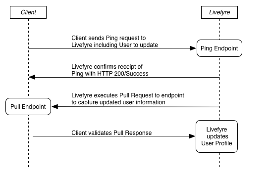

# 引き出し用のPingを使用したLivefyreとの同期{#sync-with-livefyre-using-ping-for-pull}

Pingを使用して引き出しを行い、Livefyreをユーザー管理システムと同期させます。

一般に、Webサイト/アプリの ***ユーザーがプロファイル（表示名、アバターなど）を更新し、Livefyreがそのユーザーの更新されたプロファイルを取り込むたびに********* 、Livefyreに対してpingを実行します。

プルシーケンスのPing:

1. お客様がPingリクエストをLivefyreに送信（更新するユーザーを含む）。
1. LivefyreがHTTP 200/Successを使用してPingを受け取ったことを確認します。
1. Livefyreはプル要求を処理します。
1. Livefyre queuesプル要求。
1. Livefyreは、更新されたユーザー情報を取り込むために、エンドポイントに対してプル要求を実行します。
1. 顧客はプル応答を受け取り、検証します。
1. Livefyreは、プルエンドポイントに含まれる外部プロファイル情報でリモートプロファイルを更新します。

ユーザーがプロファイル情報を更新するたびにLivefyreに対してpingを実行します。 引き出し完了時間に対するpingはネットワーク負荷に応じて異なる場合がありますが、1 ～ 10分でユーザー情報が更新されます。 更新されたプロファイルの変更は、まずLivefyre Studio/ユーザー内に表示されます。

更新されたプロファイル情報は、2つのイベントの後にLivefyreアプリに表示されます。

* ユーザーがログアウトし、アプリに再度ログインします。 userAuthTokenの表示名の値は、プルの更新の場合はPingよりも優先されます。 ユーザーがログアウト/ログインすると、トークンが更新され、セッションが更新されます。

   プロファイル情報の更新時に新しいuserAuthTokensを生成するには、SSO authDelegateを使用してユーザーをログアウトし、バックグラウンドで再びログインします。

* コレクションに対するブートストラップの更新により、更新された情報が（5 ～ 10分ごとに）取り込まれます。

ユーザプロファイルシステムのプル用にPingを実装するには：

1. [プルエンドポイントを構築します](#t_build_the_pull_endpoint)。

   >[!NOTE]
   >
   >Livefyreライブラリには、ユーザープロファイルを最新の状態に保つためのsyncUserメソッドが含まれています。 Livefyreライブラリを使用する場合は、次の2つの手順をスキップします。

1. [プルエンドポイントをStudioに登録します](#register_the_endpoint_with_studio)。
1. [Pingを構築します](#t_build_the_ping)。
1. [プル応答用のPingを作成します]。(#reference_n3x_pzb_mz)
