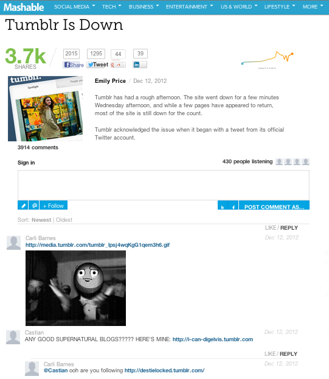

# コメント{#comments}

リアルタイムのコメントをアプリに埋め込む。

コメントは、デフォルトのコメントをリアルタイムの会話で置き換えます。ソーシャル統合機能により、TwitterやFacebookでの投稿に関するすべての会話を簡単にキャプチャし、ユーザーの友達を会話に引き込むことができます。

マッシュブルではコメントを使用して、ディスカッションでユーザーパーティシペーションを向上します。リッチメディアのアップロード、ソーシャルシェア、リスナーカウント、シングルサインオンのヘルプを含む機能で、会話の容易かつ楽しく貢献します。

<!-- 

c_comments_app.dita

 -->

