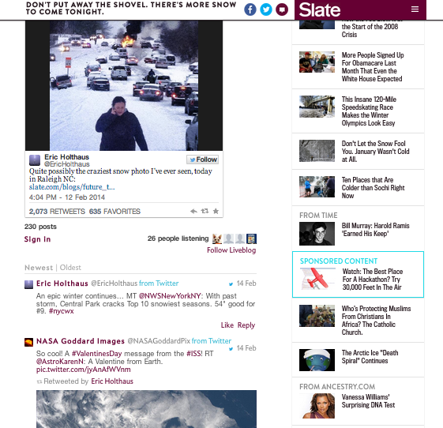

# ライブブログ{#live-blog}

Live Blogを使用すると、ライターや編集者はリアルタイムの更新を投稿し、サイトを魅力的なライブニュースソースに変換できます。

画像、ビデオ、オーディオ、埋め込みコンテンツに富んだチーム別の投稿が、新しい会話やスレッドのソースになります。 Live Blogは、商品のリビール、賞与を受けるプログラム、スポーツイベントに最適です。

Live Blogは、次の点でコメントとは異なります。

* 所有者とモデレーターのみがコメントボックスを表示し、最上位レベルの投稿を作成できます。
* ユーザーの返信を無効にして、ブロガーのみの体験を作成できる場合があります。
* ユーザーは、コンピューターや携帯端末から埋め込み可能なリンクを書き込んだり、写真をアップロードしたり、投稿したりできます。
* コメントのフォントは大きくなり、アバターは小さくなり、内容が強調されます。
* 必要に応じて、アバターを無効にできます。

スレート氏は、再び吹雪が来ると、読者に東海岸での荒れ狂った天候の揺れに関する情報をすぐに提供したいと考えていた。 スレート編集者はライブブログを使って、自分の写真、ユーザツイート、降雪に関する情報など、嵐に関する更新情報を即座に共有できました。 ライブブログはとても役に立ったのでスレートのサイトの一面を飾った。

