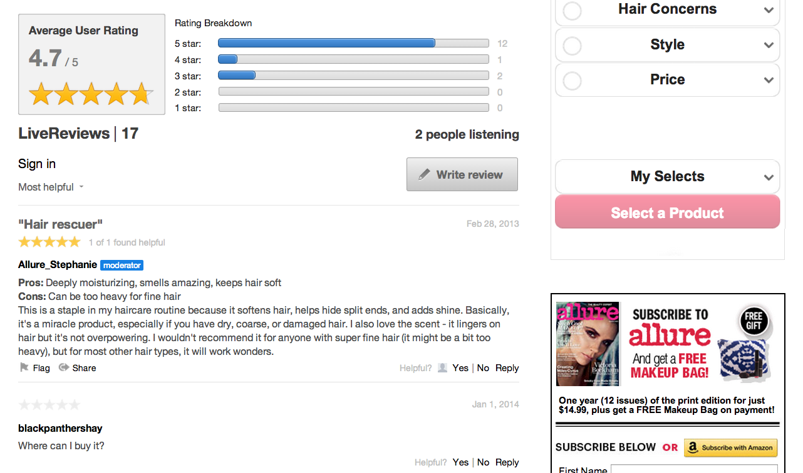

# レビュー{#reviews}

Webサイト上のコンテンツの一部をリアルタイムで評価し、確認します。

レビューを使用すると、製品、サービス、記事、またはWebサイト上の任意のコンテンツの評価やレビューをリアルタイムで簡単に行うことができます。

レビューアプリに投稿される各レビューは、1行のレビュータイトル、本文、数値評価で構成されます。 タイトルとレーティングを含めることで、レビューアプリはユーザーの意見を定量化し、その製品やサービスに対するユーザーのエクスペリエンスの概要を提供します。

デフォルトのレビューアプリは、レビューのコレクションと、コレクションの平均ユーザー評価と評価の分類を表示する概要セクションで構成されます。 ユーザーは、レビューをリアルタイムで読み、操作できます。

Allueはレビューを使用して、ユーザーが特集製品に関する評価や意見を投稿するよう招待します。 Allureはレビューを使って、貴重で個人的なユーザーのフィードバックをオーディエンスから取り込むことができます。

## レビュー機能{#section_awq_xph_21b}

このアプリに固有の機能のオファーをレビューします。

* ストリーム上のトレンド（星の評価と平均評価の概要）を視覚的にすばやく表示します。
* 星の数とその画像、評価サブパーツ（長所や短所など）、複数の評価カテゴリを含む、カスタマイズ可能な評価インターフェイス。
* レビューコレクションの平均ユーザー評価と評価分類のグラフィックビジュアライゼーションを使用してレビューを要約します。
* キューレビューを表示できます。表示のリストの上部にユーザーのレビューを維持します。
* レビューの助けになる点に投票し、「最助となる」または「最高の評価」で並べ替えることができます。
* モバイル対応のインターフェイス。
