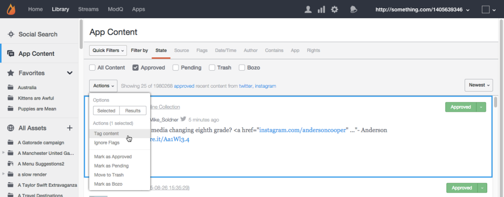
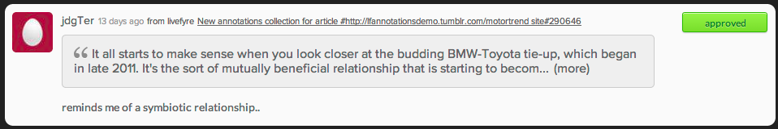

# アプリコンテンツを使用したコンテンツのモデレート{#moderate-content-using-app-content}

ライブラリの「アプリのコンテンツ」タブを使用すると、アプリ全体で公開されたコンテンツをモデレートできます。

## コンテンツのモデレート {#section_md5_sqm_zz}

アプリのコンテンツパネルを使用して、リストされているコンテンツのモデレート、ステータスの変更、作成者のステータスの変更、メモの追加を行います。コンテンツをモデレートするには、リストされているコンテンツにマウスポインターを置き、利用可能なマーカーを変更するか **[!UICONTROL pulldown]** 、メニューを使用して個別または複数の選択したコンテンツのステータスを変更します。

アプリのコンテンツでは、次のことができます。

* **[!UICONTROL Tag Content]**. コンテンツの個別または複数の部分にタグを同時に追加する **[!UICONTROL Tag Content]** 場合に選択します。

* **[!UICONTROL Ignore Flags]**. フラグ付き検索フィルター結果から選択したコンテンツを除外 **[!UICONTROL Ignore Flags]** する場合に選択します。アイテム **[!UICONTROL Ignore Flags]** を選択しても、ステータスは変わりません。これは、すべてのStudioユーザーに対して、今後この検索フィルターの検索結果から削除するだけです。

* **[!UICONTROL Change Content Status]**. コンテンツの一部をクリックし、メニューを **[!UICONTROL Actions]** 使用してステータスを変更します。（CommandキーまたはControlキーを使用して複数の項目を選択し、メニューを使用して複数のコンテンツの状態を同時に変更します）。

   オプションは、リストされているコンテンツの現在の状態によって異なります。

   | 現在の状態 | 変更先: |
   |---|---|
   | 承認済み | 保留中、ごみ箱、ブーゾ |
   | Boszo | 承認済み、保留中、ごみ箱 |
   | ごみ箱 | 承認済み、保留中、Bozo、Delete |
   | 保留中 | 承認済み、ごみ箱、ボゾス |

* **[!UICONTROL Save as Assets]**. 「アドバンスオプション」ダイアログボックスを選択 **[!UICONTROL Save as Assets]** して、選択したアイテムをアセットライブラリに保存したり、アプリに投稿したり、作成者から再利用権限を要求したりできます。

* レコメンデーションに基づいてモデレートします。「アプリのコンテンツ **[!UICONTROL Moderation Recommendation Indicator]** 」で、モデレートレコメンデーションで自動化される可能性があるコンテンツをフィルターして、コンテンツをフィルターします。

   アプリのコンテンツでは、モデレートのレコメンデーションは次のようになります。 

## コンテンツをモデレートする {#section_i2s_nqm_zz}

コンテンツパネルでのSocialの操作は、他の種類のコンテンツの操作とは異なります。

* 「詳細情報」、「返信」、「フラグとレポート」および「メモを追加」タブは使用できません。
* コンテンツをタグ付けすることはできません。また、「特集」としてマークすることもできません。

また、モデレートするコンテンツだけではないという点でも異なります。また、Socialの追加時に選択したテキストも表示され、コンテキスト内のコンテンツを評価できます。

テキストボックスをクリックして展開し、ユーザーが選択した引用符全体を含めます。

コンテンツのモデレートでは、一括変更が可能で、上記のように個別のステータス変更が可能です。

## Livefyreユーザーのモデレート {#section_grw_mqm_zz}

Livefyreユーザーがプルダウンメニューを開くためのユーザー名にマウスを移動すると、リストのリストを表示 **[!UICONTROL Ban the User]****[!UICONTROL More Info]**、表示または表示 **[!UICONTROL Comments]**できます。このメニューをクリックすると、Studio **[!UICONTROL Users]** のページでユーザーの情報カードが開きます。

**[!UICONTROL Users]** ページ内のユーザーをモデレートする方法について詳しくは、「ユーザーの [モデレート」を参照](/help/using/c-features-livefyre/c-about-moderation/t-moderate-users-modq.md#t_moderate_users_modq)してください。
