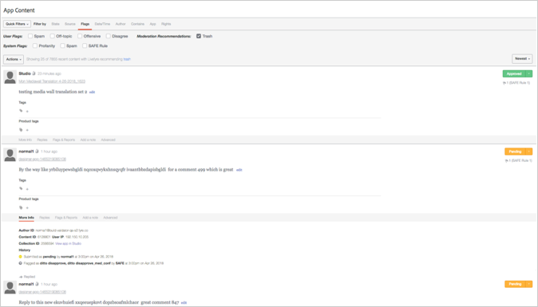

# アプリのコンテンツを使用したコンテンツのモデレート{#moderate-content-using-app-content}

ライブラリの「アプリのコンテンツ」タブを使用すると、アプリ全体で公開されたコンテンツをモデレートできます。

## コンテンツをモデレート {#section_md5_sqm_zz}

アプリのコンテンツパネルを使用して、リストに含まれるコンテンツをモデレートしたり、そのコンテンツのステータスを変更したり、作成者のステータスを変更したり、メモを追加したりします。 コンテンツをモデレートするには、リスト内のコンテンツにマウスを移動して利用可能なマーカーを変更するか、メニューを使用し **[!UICONTROL pulldown]** て選択した個々のコンテンツまたは複数のコンテンツのステータスを変更します。

アプリのコンテンツでは、次のことができます。

* **[!UICONTROL Tag Content]**. 個々の **[!UICONTROL Tag Content]** コンテンツまたは複数のコンテンツに同時にタグを追加する場合に選択します。

* **[!UICONTROL Ignore Flags]**. 選択した **[!UICONTROL Ignore Flags]** コンテンツをフラグ付きの検索フィルター結果から除外する場合に選択します。 アイテム **[!UICONTROL Ignore Flags]** を選択しても、そのステータスは変更されません。これ以降、すべてのStudioユーザに対して、この検索フィルタを検索結果から削除するだけです。

* **[!UICONTROL Change Content Status]**. コンテンツの一部をクリックし、メニューを使用し **[!UICONTROL Actions]** てステータスを変更します。 （複数のアイテムを選択するには、CommandキーまたはControlキーを使用します。次に、メニューを使用して、複数のコンテンツのステータスを同時に変更します）。

   オプションは、リストされているコンテンツの現在の状態に応じて異なります。

   | 現在の状態 | 変更可能 |
   |---|---|
   | 承認済み | 保留中、ごみ箱、房蔵 |
   | 坊蔵 | 承認済み、保留中、ごみ箱 |
   | ごみ箱 | 承認済み、保留中、房蔵、削除 |
   | 保留 | 承認済み、ごみ箱、房蔵 |

* **[!UICONTROL Save as Assets]**. 選択 **[!UICONTROL Save as Assets]** したアイテムをアセットライブラリに保存したり、アプリに公開したり、作成者に再利用権限を要求したりするための、詳細オプションダイアログを開きます。

* レコメンデーションに基づいてモデレートします。 「アプリのコン **[!UICONTROL Moderation Recommendation Indicator]** テンツ」を使用して、モデレートのレコメンデーションでトラッシュされる可能性が高いと識別されるコンテンツをフィルターします。

   アプリコンテンツでのモデレートのレコメンデーションは次のようになります。  

## サイトコンテンツをモデレート {#section_i2s_nqm_zz}

コンテンツパネルでのサイトの操作は、他のタイプのコンテンツの操作と異なります。

* 「詳細情報」、「返信」、「フラグとレポート」および「メモの追加」タブは使用できません。
* コンテンツのタグ付けや、「おすすめ」とマークすることはできません。

また、モデレートするコンテンツだけでなく、また、「サイトの追加」の際に選択したテキストも表示され、コンテキスト内のコンテンツを評価できます。

テキストボックスをクリックして展開し、ユーザーが選択した見積もり全体を含めます。

コンテンツモデレートをサイズ設定すると、上で説明したように、一括変更と個々のステータス変更の両方が可能になります。

## Livefyreユーザーのモデレート {#section_grw_mqm_zz}

Livefyreユーザーのユーザー名にマウスを移動して、プルダウンメニューを開き、ユーザー **[!UICONTROL Ban the User]**&#x200B;はそのユー **[!UICONTROL More Info]**&#x200B;ザーのリストを表示、取得または表示できま **[!UICONTROL Comments]**&#x200B;す。 このメニューをクリックすると、Studioのページでユーザの情報カードが開き **[!UICONTROL Users]** ます。

ページ内のユーザーをモデレートする方法について詳しくは、「ユーザーのモデ **[!UICONTROL Users]** レート」モデレー [トのModQを参照してください](/help/using/c-features-livefyre/c-about-moderation/t-moderate-users-modq.md#t_moderate_users_modq)。
