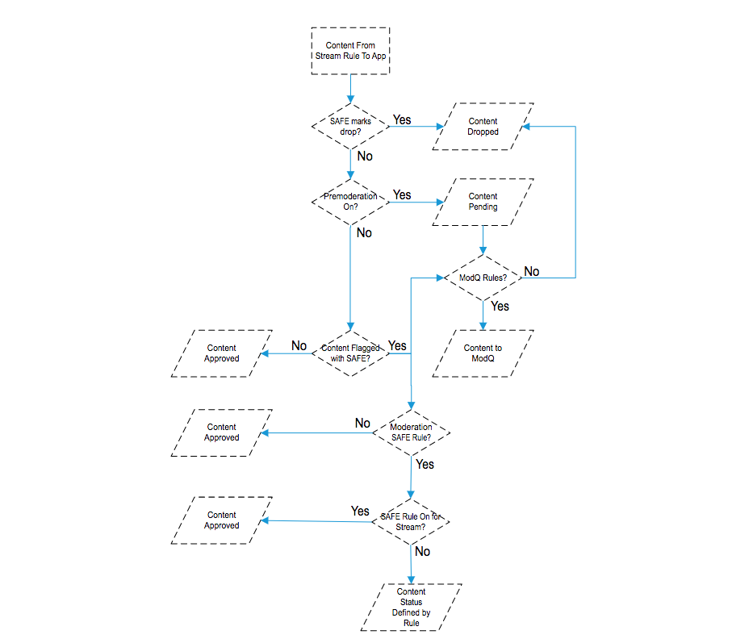
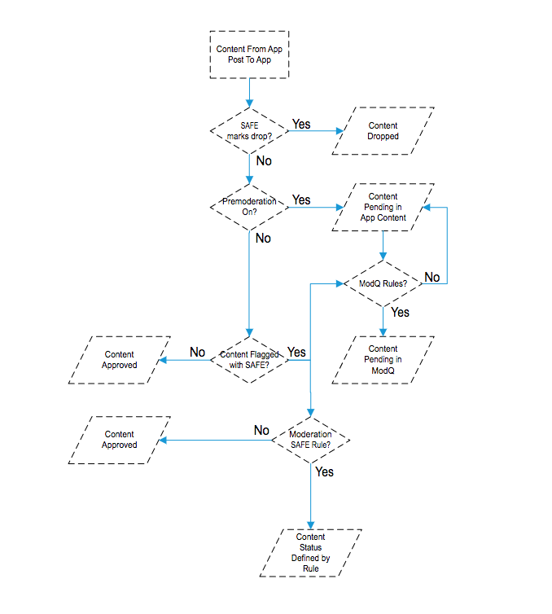
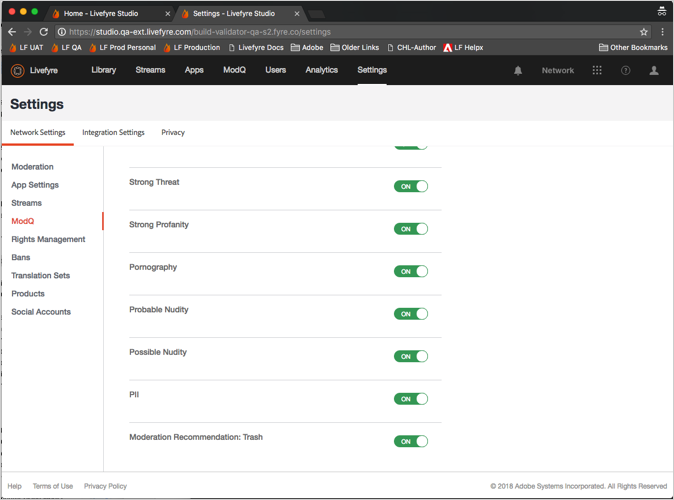
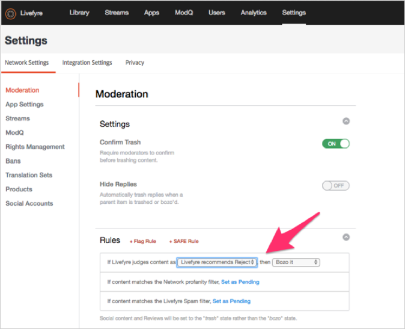
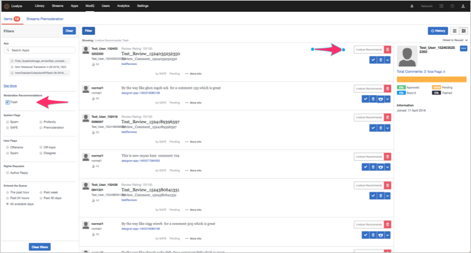
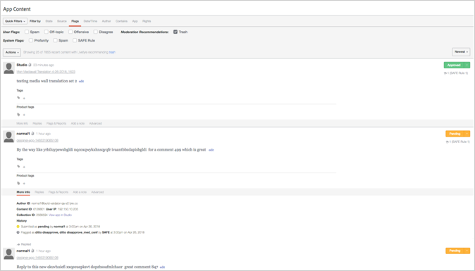

# モデレートの設定{#setting-up-moderation}

「モデレート」タブを使用して、不敬リスト、フラグルール、禁止されているIPアドレスなど、受信コンテンツの事前モデレートルールを設定します。

## モデレートの仕組み {#section_kyf_gvc_t1b}

コンテンツは次の方法でモデレートできます。

* コンテンツを自動的にモデレートして、コンテンツを公開する前に設定したルールに基づいて、意図しないコンテンツをフィルターします。
* ライブラリ内のModqまたはAppコンテンツを使用して、自動モデレートを使用してフラグ付けされたコンテンツを手動で削除または承認します。
* 特定のLivefyreユーザー、ソーシャルユーザーまたはIPアドレスをバンニングすることで、繰り返し不快なコンテンツを投稿するサイト訪問者を識別します。
* ユーザーをホワイトリストに登録したり、特定のストリーム、サイトまたはネットワークのフィルターをオフにしたりすることで、常に表示する人とコンテンツを識別します。

コンテンツは、次の方法で自動的に事前モデレートできます。

* 特定のタイプのコンテンツに自動的にフラグを付けるルールを設定します。

   * サイト訪問者フラグによってフラグ付けされるコンテンツのフラグルールを設定します **[!UICONTROL Settings > Moderation > Rules]**
   * 安全なルールの設定 **[!UICONTROL Settings > Moderation > Rules]**
   * 特定のTwitterユーザーを **[!UICONTROL Settings > Streams]**
   * 使用するIPアドレスの禁止 **[!UICONTROL Settings > Bans]**
   * 国別IP地域をリクエストによって禁止する。禁止されているコンテンツはスパムとしてマークされます。

* ネットワークまたはサイトの下の **[!UICONTROL Settings > Moderation > Rules]** 不敬リストで、不敬と見なす単語のリストを作成します。
* 特定のストリーム、サイトまたはネットワークのフィルターを使用または無効にすることによって、ユーザーに対して（常にこれらのユーザーからのコンテンツを許可する）ホワイトリストを表示します。

不敬なリスト、セーフフィルター、ルールを設定したら、コンテンツをモデレートし、ストリーム内でセーフフィルターを適用するかどうかを選択できます。詳しくは、すべてのストリームルールの [ストリームルールオプション](/help/using/c-streams/c-stream-rule-options-for-all-stream-rules.md#c_stream_rule_options_for_all_stream_rules)を参照してください。

コンテンツを **[!UICONTROL Approved]****[!UICONTROL Pending]**、など **[!UICONTROL Junk]**のようにLivefyreによってマークします。コンテンツの開始場所、公開場所、システムで設定したルールによって異なります。次の表では、Livefyreアクションについて詳しく説明します。これらの要素について詳しくは、以下を参照してください。

## モデレートの仕組み

| コンテンツ提供元: | コンテンツの送信先: | 承認ステータス |
|--- |--- |--- |
| ライブラリ | アプリ | コンテンツの承認 |
| ソーシャル検索 | アプリ | コンテンツの承認 |
| ストリームルール | アプリ | スパムとしてマークされているコンテンツは、安全なフィルターであるか。  <ul><li>いいえ-アプリ間のモデレートワークフロー</li><li>はい-コンテンツの分割</li></ul> |
| ライブラリ | フォルダ | ステータスなし（フォルダー内、非公開ではない） |
| ソーシャル検索 | フォルダ | ステータスなし（フォルダー内、非公開ではない） |
| ストリームルール | フォルダ | スパムとしてマークされているコンテンツは、安全なフィルターであるか。  <ul><li>いいえ-ステータス（フォルダー内、公開されず、非公開）</li><li>はい-コンテンツの分割</li></ul> |
| アプリ投稿 | アプリ | スパムとしてマークされているコンテンツは、安全なフィルターであるか。  <ul><li>いいえ-アプリ間モデレートワークフロー</li><li>はい-コンテンツの分割</li></ul> |

## アプリ間のモデレートワークフロー {#section_z5z_w4d_t1b}

ストリームからのコンテンツがアプリに公開される前に、Livefyreは次のチェックを実行して、コンテンツの処理を決定します。

1. 安全なフラグとしてコンテンツが表示される場合、コンテンツはLivefyreによって自動的に作成されます。
1. 安全にコンテンツにフラグを付けない場合、Livefyreは事前モデレートがオンかどうかを確認します。
1. 事前モデレートがオンの場合、コンテンツは保留中としてマークされます。
1. Modqルールを設定すると、LivefyreはコンテンツをModqに送信します。
1. 事前モデレートがオンになっていない場合、Livefyreはコンテンツに安全フラグを付けているかどうかを確認します。
1. コンテンツにフラグを付けた場合、Livefyreはコンテンツを承認してコンテンツをアプリケーションに公開します。
1. 安全なフラグがコンテンツにフラグ付けされていない場合、Livefyreはコンテンツを承認し、コンテンツをアプリケーションに公開します。
1. SEFEがコンテンツにフラグを付け、セーフルールを設定する場合、ストリームに安全なルールを設定しているかどうかをLivefyreチェックします。
1. ストリームに安全なルールを設定すると、Livefyreはコンテンツを承認し、コンテンツをアプリケーションに公開します。ストリームにセーフルールを設定しなかった場合、Livefyreは、コンテンツの処理方法を決定するためにモデレートセーフルールを使用します（MOQ、ごみ箱などに送信します）。

## アプリ間モデレートワークフロー {#section_fwn_w4d_t1b}

アプリ投稿のコンテンツがアプリに投稿される前に、Livefyreは次のチェックを実行して、コンテンツの処理を決定します。

1. 安全フィルターでコンテンツにドロップとフラグを付けた場合、コンテンツはLivefyreによって破棄されます。
1. 安全にコンテンツにフラグを付けない場合、Livefyreは事前モデレートがオンかどうかを確認します。事前モデレートがオンの場合、コンテンツは保留中としてマークされます。Modqルールを設定すると、Livefyreはコンテンツを保留中としてModqに送信します。そうでない場合、ライブラリ内のアプリコンテンツの保留状態のままになります。
1. 事前モデレートがオンになっていない場合、Livefyreはコンテンツに安全フラグを付けているかどうかを確認します。そうでない場合、Livefyreはコンテンツを承認し、コンテンツをアプリケーションに公開します。
1. 安全なフラグがコンテンツにフラグ付けされている場合、Livefyreは安全なルールを使用してコンテンツの処理方法（MOQ、ごみ箱などに送信）を決定します。安全なフラグがコンテンツにフラグ付けされていない場合、Livefyreはコンテンツを承認し、コンテンツをアプリケーションに公開します。

## バルクフィルター {#section_lyk_ktx_vy}

一括フィルターは、短い期間内にすべてのLivefyreネットワークに投稿された繰り返しコンテンツを検索します。検出された場合、このコンテンツはバルクとしてフラグ付けされ、デフォルトで粉砕されます。バルクコンテンツはユーザ生成である場合がありますが、"TouchDown"などです。は、一般的なフットボールゲームの際に、チャットで繰り返し投稿されます。ほとんどの場合、スパムキャンペーンに起因します。このフィルターは言語に依存せず、任意の言語で動作します。一括フィルターをカスタマイズするには、Livefyreサポートにご連絡いただく必要があります。

## ルール {#section_gqz_ksk_f1b}

「ルール」セクションを使用して、安全なフラグとユーザー適用フラグに基づいて、モデレートルールを作成します。このパネルには、次の2種類のルールが用意されています。

* **[!UICONTROL Flag Rules:]** ユーザーが定義した回数のコメントに対して実行するアクションを指定します。
* ****[!UICONTROL SAFE Rules:]は、フラグ付きコンテンツを実行するアクションと共に、安全フラグを組み合わせます。

フラグルールを作成するには、フラグ（不快、トピックオフ、非表示またはスパム）を選択し、コンテンツの一部に適用する必要のある回数を入力して、実行するアクションを選択します。フラグオプションごとに1つのフラグルールを設定できます（「不快」、「トピックのオフ」、「非表示」または「スパム」）。

ルールは、ネットワーク、サイト、ストリームレベルで作成できます。サイトレベルルールは、サイトルールが異なる場合を除き、ネットワークルールを継承します。ストリームルールは、異なる設定をしない限り、サイトルールを継承します。

使用可能なアクション:

* ****[!UICONTROL Trash it:]はフラグ付きのコメントをごみ箱に送信します。
* **[!UICONTROL Bozo it:]** により、ポスターを除くすべてのユーザーからフラグ付きコメントが非表示になります。
* **[!UICONTROL Pending:]** は、コンテンツを保留中として設定します。「 **[!UICONTROL Settings > ModQ]**事前モデレート」を"ON"に設定した場合、それはMOQになります。そうしないと、アプリケーションのコンテンツのみに含まれます。

>[!NOTE]
>
>スパムとしてフラグ付けされているBoszoコメントや、5人のユーザーによる攻撃としてフラグ付けされたルールをLivefyreで作成することをお勧めします。

## モデレートの推奨事項 {#section_ec3_vr3_2cb}

モデレートレコメンデーションを使用すると、Livefyreアプリでサイト訪問者が投稿したコンテンツをモデレートする方法を決定できます。モデレートレコメンデーションインジケーターは、以前同様のコンテンツに対して行ったアクションに基づいて、コンテンツの一部が粉砕される可能性がある場合に推奨します。モデレートのRecommendationsを使用するには:

1. Adobe Livefyreサポートプロフェッショナルに連絡して、モデレートのRecommendations機能を有効にします。
1. ネットワーク設定でモデレートのレコメンデーションを設定します。

   以下の **[!UICONTROL Livefyre Recommends Trash]** 設定を使用して、モデレートのレコメンデーションを設定 **[!UICONTROL Network Settings]**します。

   

1. 安全なルールを設定して、モデレートレコメンデーションでコンテンツとして扱われるコンテンツについて、粉砕される可能性があるコンテンツとして知らせることができます。**[!UICONTROL Livefyre Recommends Trash]** オプションのセーフルールの設定方法について詳しくは [、「モデレート](/help/using/c-features-livefyre/c-about-moderation/c-moderation.md#c_moderation)」を参照してください。

   

1. モデレートレコメンデーションで特定されるコンテンツをフィルターするコンテンツをフィルターするには、MOQまたはアプリのコンテンツ **[!UICONTROL Moderation Recommendation Indicator]** で使用します。

   MOQでは、インジケーターは次のようになります。 

   Moderation Recommendationsを使用してModak内のコンテンツをモデレートする方法について詳しくは [、Modq](/help/using/c-features-livefyre/c-about-moderation/c-modq.md#c_modq)を参照してください。

   アプリのコンテンツでは、モデレートのレコメンデーションは次のようになります。 

   アプリコンテンツでのモデレートRecommendationsの使用方法について詳しくは、「アプリコンテンツを使用したコンテンツ [のモデレート](/help/using/c-features-livefyre/c-about-moderation/c-moderate-content-using-app-content.md#c_moderate_content_using_app_content)」を参照してください。
