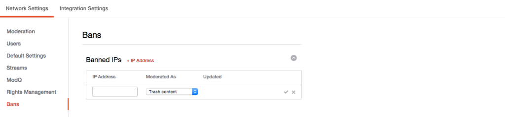

# IPアドレスの禁止{#ban-ip-addresses}

悪意のあるユーザーが同じIPアドレスから複数のアカウントを作成した場合は、IPアドレスを禁止できます。

禁止されたユーザーが自分のコメントを見ていないと気付いた場合は、別のユーザー名とアバターを使用して新しいユーザーアカウントを作成し、この新しい禁止されていないアカウントから不適切なコメントやスパムのコメントを投稿し始める可能性があります。 モデレーターがコンテンツを同じユーザーと認識し、（アカウントの詳細ページから）コメントを投稿したユーザーのIPアドレスを確認して、この前提を確認できます。

1. 禁止され **[!UICONTROL + IP Address]** たIPパネルでをクリックします。
1. フィールドにIPアドレスを入力します。 IPアドレスの範囲を禁止するには、「192.168.0.1 - 192.168.0.10」の形式で範囲を入力し（IPアドレスをスペースで区切り、すべて引用符で囲んだダッシュを使用）、をクリックします **[!UICONTROL Save]**。
1. プルダウンメニューからアクション（ごみ箱、プリモデレートまたはボゾコンテンツ）を選択します。
1. 保存するには、チェックマークをクリックします。
