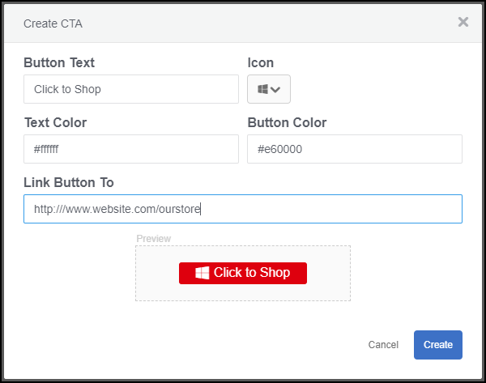
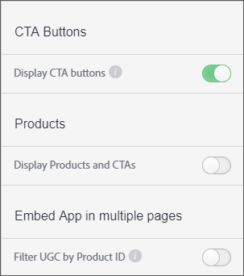

# カスタム誘い文句（CTA：コールトゥアクション）ボタン{#custom-call-to-action-button}

## カスタム誘い文句（CTA：コールトゥアクション）ボタン{#topic_EBE23A0F827645E0A0C619DCF3872EE5}

カスタムの誘い文句(CTA)ボタンは、コンテンツをアクション可能にするためにLivefyre Studioの任意のアセットに追加できるボタンです。 エンドユーザーは、ソーシャルメディアページや買い物かごなど、カスタマイズされたURLを参照できます。 CTAボタンはLivefyreの複数の場所に作成できますが、Livefyre Studioの&#x200B;**[!UICONTROL Settings]**&#x200B;セクション内で管理されます。

カスタムCTAを使用すると、次のことができます。

* Livefyreのメディアウォール、モザイク、カルーセル、フィルムストリップ、個々の機能カードにあるUGCの任意の部分に対する追加カスタムCTAボタン。
* メッセージ、アイコン、色、リンク、およびUGCの各部分のボタン数を制御できます。
* 設定およびライブラリ内からカスタムCTAボタンを作成、管理、再利用できます。
* Adobe Analyticsを使用して、クリックスルー率を測定します。

## カスタム誘い文句（CTA：コールトゥアクション）ボタンの作成{#task_C61B4A8E66F24AC19C833612E596B736}

タスクコンテキスト

1. Livefyre Studioで、**[!UICONTROL Settings]**&#x200B;をクリックします。
1. 左側のレールで、**[!UICONTROL CTAs]**&#x200B;をクリックします。

   CTAライブラリが表示され、CTAを作成し、フォルダ内で整理できます。 1. **[!UICONTROL Create CTA]**&#x200B;をクリックします。
1. 目的のカスタマイズをフィールドに入力すると、「CTAを作成」画面の下部にボタンプレビューがレンダリングされます。

   

1. クリック **[!UICONTROL Create]**.

   これで、CTAボタンを任意のアセットに追加できるようになります。

## ア追加セット{#task_36190DD1C8204C7793CB7EEA379C2155}に対するカスタム誘い文句（CTA：コールトゥアクション）ボタン

Livefyre 追加 Studioの任意のコンテンツに対するCTAボタン。

1. Livefyre studioで、**[!UICONTROL Library]** > **[!UICONTROL All Assets]**&#x200B;に移動します。
1. CTAボタンを追加するアセットを1つ以上選択します。
1. クリック **[!UICONTROL CTAs]**.

   

1. リストから目的のCTAボタンを選択し、**[!UICONTROL Add]**&#x200B;をクリックします。

   選択したアセットにCTAボタンが表示されます。

   >[!NOTE]
   >
   >各アセットに関連付けたカスタムCTAをアプリに表示するには、アプリ設定でCTAボタンを有効にする必要があります。
   >
   >
