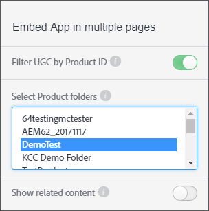

# 製品IDでUGCをフィルタ{#filter-ugc-product-id}

製品IDでUGCをフィルタリングすると、同一のアプリを複数のページに埋め込むと同時に、各ページに対して製品固有の異なるUGCを表示できます。

製品IDでUGCをフィルタリングするには、次の手順に従います。

1. Livefyre Studioで、**[!UICONTROL Apps]**&#x200B;タブに移動します。

1. 変更するアプリを選択します。

1. 左側のパネルで「Designer」タブを選択します。

1. 有効にする **[!UICONTROL Filter UGC by Product ID]**.



1. UGCをフィルターする1つまたは複数の製品を含む最上位の製品フォルダーを選択します。
複数のフォルダを選択するには、CtrlまたはCommandキーを押しながらクリックします。

1. **[!UICONTROL Show related content]**を無効にします。
有効にすると、`data-lf-attr-product`属性を使用してフィルタリングされたコンテンツが最初に表示され、その後アプリ内の他のすべてのコンテンツが表示されます。

1. クリック **[!UICONTROL Publish]**.

1. フィルターに使用する製品IDを結果のコードに挿入します。

>[!NOTE]
>
>製品IDを探すには、**[!UICONTROL Settings > Products]**&#x200B;に移動します。 目的の製品を見つけて選択すると、IDが表示されます。

例えば、Media Wallアプリ用に次のコードが生成されます。

```
<script type="text/javascript" src="https://cdn.livefyre.com/
Livefyre.js"></script><div class="lf-app-embed" data-lfapp="
59dc41fa-85a5-49ed-8d60-d74616b3ccd1/tagged/published" datalf-
env="prod" data-lf-read-only="" data-lf-attr-product="<product
 1>,<product 2>"></div><script>Livefyre.require(["app-embed#1.0.11"],
 function (appEmbed) {appEmbed.loadAll().done(function(embed)
 {embed = embed[0];if (embed.el.onload && embed.getConfig)
 {embed.el.onload(embed.getConfig());}});});</script>
```

製品にタグを付けるには、`data-lf-attr-product`属性の`<product 1>`を目的の製品IDに置き換えます。 コンマ区切りの製品IDを追加して、1つ以上の製品にタグを付けることができます。 productsは、手順5で選択した最上位の製品フォルダー（複数可）内に含まれている必要があります。

変更したコードセグメントは次のように表示されます。

```
<script type="text/javascript" src="https://cdn.livefyre.com/
Livefyre.js"></script><div class="lf-app-embed" data-lfapp="
59dc41fa-85a5-49ed-8d60-d74616b3ccd1/tagged/published"
 data-lf-env="prod" data-lf-read-only="" data-lf-attrproduct="
109,47"></div><script>Livefyre.require(["app-embed#1.0.11"],
 function (appEmbed) {appEmbed.loadAll().done(function(embed)
 {embed = embed[0];if (embed.el.onload && embed.getConfig)
 {embed.el.onload(embed.getConfig());}});});</script>
```

現在は、タグ付けされた製品IDのみが表示されます。
