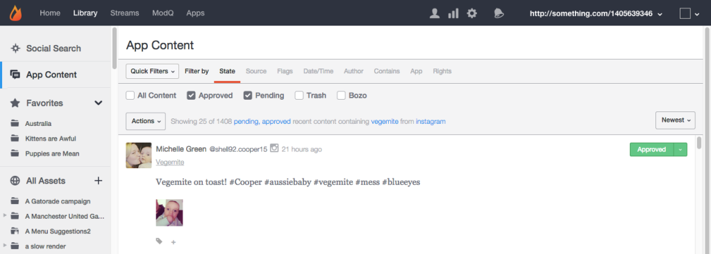
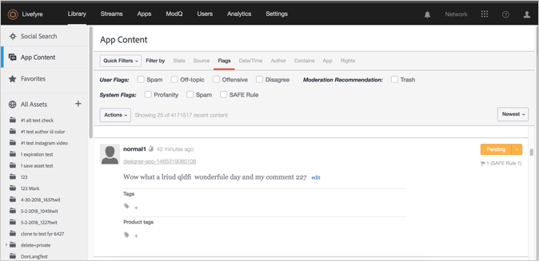
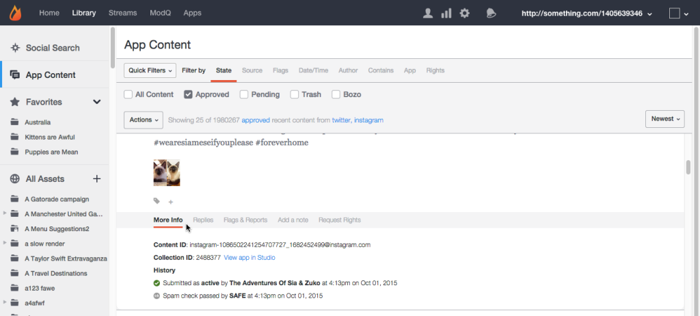

# 「アプリのコンテンツ」タブ{#app-content-tab}

Livefyreネットワーク全体でのコンテンツの管理

ライブラリの「アプリのコンテンツ」タブを使用すると、アプリ全体で公開されたコンテンツを検索してモデレートできます。**[!UICONTROL App Content]** このタブでは、ワイルドカード検索を使用して複数の検索フィルターを有効にし、検索パラメーターをより迅速かつ容易に定義できます。

「アプリケーションのコンテンツ」タブを使用すると、次のことができます。

* コンテンツの検索
* コンテンツ履歴の表示
* コンテンツのモデレート
* タグの追加
* 機能コンテンツ
* 製品カタログの製品にコンテンツを関連付ける

「アプリのコンテンツ」タブを使用してコンテンツをモデレートする方法について 詳しくは、を参照してください。

## ワイルドカード検索 {#section_jvr_ntm_zz}

Livefyre検索フィールドではワイルドカードがサポートされています。ワイルドカードを使用すると、単語（またはワードフラグメント）にアスタリスク（*）を追加して部分一致を検出できます。

次に例を示します。

* ボールはボールのみを返す
* ball*がボールとバルーンを返す
* * ballがボールとフットボールを返す
* * ball*ボールとユニボールと雪が返される

## コンテンツの検索 {#section_fw1_mtm_zz}

アプリのコンテンツパネルでは、複数の異なるコンテンツフィルターオプションを使用して検索を絞り込むことができます。

**[!UICONTROL Quick Filters]** プルダウンを使用して、返されたコンテンツを **[!UICONTROL All Content]****[!UICONTROL All Sidenotes]****[!UICONTROL Approved]****[!UICONTROL Approved & Flagged]****[!UICONTROL Pending]****[!UICONTROL Rights Requests]** 、またはステータスに絞り込みます。次に **[!UICONTROL Filter by]** 、オプションを選択し、検索を絞り込むために使用できるチェックボックスまたは入力フィールドを使用します。

プルダウンメニューを使用して、リスト内のコンテンツを **[!UICONTROL Newest]****[!UICONTROL Oldest]****[!UICONTROL Recently updated]****[!UICONTROL Most flags]****[!UICONTROL Most liked]**、または、または

## オプションでフィルター {#section_aqn_xqm_zz}

バーを **[!UICONTROL Filter by]** 使用して、次のオプションを使用してフィルターします。

* **状態** コンテンツの現在のモデレート状態でフィルターできます。** [!UICONTROL All Content]** **[!UICONTROL Approved]****[!UICONTROL Pending]**、 **[!UICONTROL Bozo]**または.

* **ソース** コンテンツのソースでフィルターできます。ユーザー生成コンテンツをストリームに直接投稿する **[!UICONTROL Livefyre]** 場合に選択します。それら **[!UICONTROL Facebook]****[!UICONTROL Twitter]**のソースからアプリに取り込まれたコンテンツを選択するか、また **[!UICONTROL RSS]** は含めます。

* **フラグ** 選択フラグを使用すると、安全（不敬、スパム、また **[!UICONTROL User Flags]** は悪意のあるモデレート）によって適用される **[!UICONTROL System Flags]** （不問、スパム、または悪意のあるモデレート）ことで、フィルターを適用でき **[!UICONTROL Moderation Recommendations]**ます。 

* **日付/時間** コンテンツが最初に表示 **[!UICONTROL Created]** された（またはSocialSyncまたはストリームを通じてアプリに取り込まれた）とき、または最後 **[!UICONTROL Modified]** （編集、フラグ付け、状態が変更された場合）によって、サイトを分割できます。

* **作成者** は、発言者 **[!UICONTROL IP]** のアドレス（ユーザーパネルまたは発言者 **[!UICONTROL Display Name]** が投稿したコンテンツの上）または **[!UICONTROL User ID]**（ユーザーパネルに表示されているコンテンツ）でフィルタリングできます。

* **「次を含む」で** は、最近の90日間のコンテンツをフィルター **[!UICONTROL Keyword]****[!UICONTROL Content Tag]**できます。メディアを含むコンテンツのみを返す **[!UICONTROL Media]** チェックボックスを選択します。（すべてのコンテンツを検索するには、リスト内のすべてのコンテンツを下にスクロールして、をクリック **[!UICONTROL Search full data]**します）。

   **注意:** 複数のキーワードおよびコンテンツタグ検索はサポートされていません。複数のキーワードまたはタグを入力すると、最後の単語が検索に使用されます。

   コンテンツタグで検索する場合、検索フィールドに入力すると、推奨タグが自動入力されます。検索結果は、タグが割り当てられているすべてのコンテンツを返します。（このフィールドを使用して特集コンテンツを検索するか、Studioの特集コンテンツの **[!UICONTROL Featured]** ラベルをクリックします）。

   **注意:** タグ名の前にマイナス（-）記号を使用して、そのタグを含まないコンテンツを検索します。次に例を示します。"- Miley"を検索して、"Mily"タグを含まないすべてのコンテンツを検索します。

* **App** Allows you to filter by **[!UICONTROL Collection ID]**, **[!UICONTROL App Tag]**, or **Parent ID**. 親IDでフィルタリングすると、入力コンテンツIDに対する返信であるすべてのコンテンツが返されます。（複数のタグでフィルターするには、タグをコンマで区切って入力します）。

* **Rights** Requestステータスでフィルターできます。** [!UICONTROL Requested]** **[!UICONTROL Granted]****[!UICONTROL Replied]**、 **[!UICONTROL Expired]**または.

## Bozo Content {#section_afl_vqm_zz}

アプリでは **[!UICONTROL Bozo]** 、コンテンツはコンテンツの作成者にのみ表示されます。これにより、ユーザーは自分のコンテンツを承認され、他のすべてのユーザーおよびモデレーターから非表示にすることができます。

>[!NOTE]
>
>SocialSyncまたはStreams **[!UICONTROL cannot]** を使用して作成されたSocialコンテンツは、Boszoに設定されます。

コンテンツは次のような理由で使用できます。

* 安全にスパムとして識別されたコンテンツは、自動的にBoszo状態に設定されます。
* 禁止されているユーザーのコンテンツはすべて、自動的にBoszoに設定されます。
* コンテンツはStudioからBoszoにマークされることがあります。
* モデレーターはコンテンツをストリーム内で直接表示できます。

## コンテンツ履歴の表示 {#section_ayz_tqm_zz}

コンテンツパネルでは、事前モデレート、スパムフィルター、投稿日、項目に割り当てられているメモやメモなど、一覧表示されているすべてのコンテンツの履歴を確認できます。

コンテンツパネルの下部にあるタブを使用して、履歴を表示します。

* **[!UICONTROL More Info:]** には、送信、編集、スパムチェック、状態変更およびメモなど、このコンテンツに対するすべてのアクティビティが表示されます。LivefyreコンテンツIDとユーザーのIPアドレスもこのセクションに表示されます。
* **[!UICONTROL Replies:]** には最大6件の返信が表示されます。投稿へのすべての返信を表示 **[!UICONTROL Show all replies]** するには、をクリックします。

* **[!UICONTROL Flags & Reports:]** すべてのユーザーフラグ、コンテンツにフラグを付けたユーザーのアバター、およびコンテンツ（コンテンツにフラグを付けたときにユーザーによって追加されたメモ）を表示します。
* **[!UICONTROL Add a note:]** を使用すると、メモを追加したり、他の管理者やモデレーターに表示したりできます。
* **[!UICONTROL Request Rights:]** によって **[!UICONTROL New Rights Request]** 、Rights Requestが発行されるダイアログが開きます。

* ****[!UICONTROL Save as Asset:]を開くと **[!UICONTROL Advanced Options]** 、選択したアイテムをアセットライブラリに保存したり、アプリケーションに投稿したり、作成者から再利用権限を要求したりできます。

## コンテンツへのタグの追加 {#section_xb4_mxr_rdb}

コンテンツのタグ付けを行うと、コンテンツを分類して整理したり、コンテンツを整理したり、特集どおりにコンテンツをマークしたりできます。

タグを追加するには、コンテンツの下にあるプラス（ **[!UICONTROL +]**）アイコンをクリックします。新しいタグを入力するか、既存のタグのリストから選択します。

## すべてのアセットの画像の検索 {#section_zxf_hsf_wcb}

コンテンツをライブラリに追加したら、スマートタグでコンテンツを検索できます。

ライブラリの「すべてのアセット」で、既存の画像をクリック **[!UICONTROL Show Filters]** して、次のいずれかをクリックします。

* 検索フィールドで検索するテキストの入力
* 関連性順の並べ替え
* スマートタグで検索する **[!UICONTROL Tags]** フィールドにテキストを入力します。スマートタグのランキングアルゴリズムは、スマートタグの信頼性スコアを使用したコンテンツのフィルター、コンテンツの新規作成、ユーザーがコンテンツに与えた数の星の数を示します。

## 重点コンテンツ {#section_emb_kqm_zz}

コンテンツを特集としてマークするデフォルト **[!UICONTROL Featured]** のタグを選択し、ユーザーに重要としてハイライトします。タグ付けしたら、カスタムスタイリングオプションを使用してアプリの特集コンテンツをカスタマイズします。

## 機能または機能のないコンテンツ {#section_ojx_3qm_zz}

* Studioから、コンテンツの横の **[!UICONTROL +]** 記号をクリックし、ドロップダウンリストで **[!UICONTROL Featured]** タグを選択して、「特集コンテンツ **[!UICONTROL Enter]** 」をクリックします。タグが保存され、コンテンツの横に表示されます。

* 機能を停止するには、コンテンツ **[!UICONTROL x]** の一部に表示されている **[!UICONTROL Featured]** タグをクリックします。

* コメント、ライブブログまたはレビューアプリ内で、特集するコンテンツの上にカーソルを移動し、をクリック **[!UICONTROL Feature]**します。機能を停止するには、コンテンツの上にマウスポインターを置いて、をクリック **[!UICONTROL Unfeature]**します。

>[!NOTE]
>
>スペースの制約により、チャットコンテンツはStudioを使用して特集または非表示にすることができ、アプリ自体では取り上げないことがあります。

## 重点コンテンツの編集 {#section_pyw_hqm_zz}

コンテンツに関する通常のアクションは、以下を除く重点コンテンツで実行できます。

* 重点コンテンツにフラグを付けることはできません。
* ユーザーは、コンテンツが提供された後でそのコンテンツを編集できませんが、必要に応じて削除できます。モデレーターは、重点コンテンツを編集できます。

