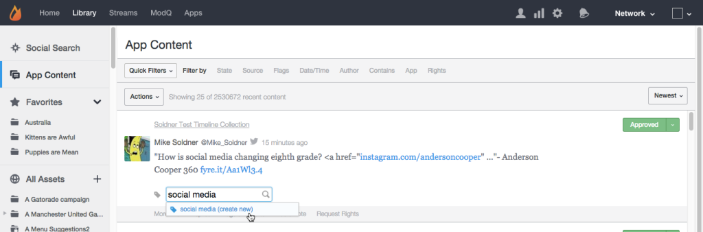

# 「アプリのコンテンツ」タブ{#app-content-tab}

Livefyreネットワーク全体でのコンテンツの管理を参照してください。

ライブラリの「アプリのコンテンツ」タブを使用すると、アプリ全体で公開されたコンテンツを検索およびモデレートできます。 このタ **[!UICONTROL App Content]** ブを使用すると、ワイルドカード検索を使用した検索フィルターを使用して、検索パラメーターをよりすばやく簡単に定義できます。

「アプリのコンテンツ」タブを使用して、次の操作を行います。

* コンテンツの検索
* コンテンツ履歴の表示
* コンテンツをモデレート
* タグを追加
* 機能の内容
* 製品カタログからのコンテンツと製品の関連付け

「アプリのコンテンツ」タブを使用してコンテンツをモデレートする方法について詳しくは、を参照してくださ い。

## ワイルドカード検索 {#section_jvr_ntm_zz}

Livefyre検索フィールドではワイルドカードがサポートされており、部分一致を検出するためにアスタリスク(*)を単語（または単語フラグメント）に追加できます。

次に例を示します。

* ボールはボールのみを返す
* ball*はボールとバルーンを返す
* *ボールはボールを返す
* *ball*は、ballとuniballとsnowballを返します。

## コンテンツの検索 {#section_fw1_mtm_zz}

アプリのコンテンツパネルでは、様々なコンテンツフィルターオプションを使用して検索を絞り込むことができます。

プルダウンを使 **[!UICONTROL Quick Filters]** 用して、返されるコンテンツを、、、、、、、または、ステ **[!UICONTROL All Content]**&#x200B;ータス **[!UICONTROL All Sidenotes]**&#x200B;に絞り込むこ **[!UICONTROL Approved]**&#x200B;とが **[!UICONTROL Approved & Flagged]****[!UICONTROL Pending]****[!UICONTROL Rights Requests]** できます。 次に、オプション **[!UICONTROL Filter by]** を選択し、使用可能なチェックボックスまたは入力フィールドを使用して検索を絞り込みます。

リスト内のコンテンツを並べ替えるには、プルダウンメニューを使 **[!UICONTROL Newest]**&#x200B;用し **[!UICONTROL Oldest]**&#x200B;ます **[!UICONTROL Recently updated]**。並べ替 **[!UICONTROL Most flags]** えの基準 **[!UICONTROL Most liked]**&#x200B;となります。

## オプションでフィルター {#section_aqn_xqm_zz}

バーを使用し **[!UICONTROL Filter by]** て、次のオプションでフィルターします。

* **状態** ：コンテンツの現在のモデレートの状態(** [!UICONTROL All Content]**、 **[!UICONTROL Approved]**、また **[!UICONTROL Pending]**&#x200B;は **[!UICONTROL Bozo]**)でフィルターできます。

* **「Source** 」は、コンテンツのソースでフィルタリングできます。 ユーザー **[!UICONTROL Livefyre]** が生成したコンテンツをストリームに直接投稿する場合に選択します。 これらのソ **[!UICONTROL Facebook]**&#x200B;ースからア **[!UICONTROL Twitter]**&#x200B;プリに取 **[!UICONTROL RSS]** り込んだコンテンツを含めるか、またはを選択します。

* **フラグの選択** では、「 **[!UICONTROL User Flags]** （スパム、トピック外、不快、または同意しない）」、「SAFE（不敬、スパム、または魔法によるモデレート）」または「 **[!UICONTROL System Flags]** 」でフィルターできます **[!UICONTROL Moderation Recommendations]**。 

* **日付/時刻** ：コンテンツが最初に投稿された（またはSocialSyncやストリームを介してAppに取り込まれた）日時、または最後に投稿された(編集された、フラグ付けされた、または状態が変更された **[!UICONTROL Created]****[!UICONTROL Modified]** )日時をフィルターできます。

* **発言者** ：発言者のアドレス、 **[!UICONTROL IP]** （ユーザーパネルまたは発言者が投稿したコンテンツの上にある）または **[!UICONTROL Display Name]****[!UICONTROL User ID]**（ユーザーパネルにある）でフィルターできます。

* **「次を含む** 」を選択すると、最新の90日間のコンテンツをまたはでフィルタリ **[!UICONTROL Keyword]** ングできま **[!UICONTROL Content Tag]**&#x200B;す。 メディアを含むコ **[!UICONTROL Media]** ンテンツのみを返す場合は、このチェックボックスを選択します。 (すべてのコンテンツを検索するには、リスト内のすべてのコンテンツを下にスクロールして、をクリック **[!UICONTROL Search full data]**&#x200B;します)。

   **** 注意：複数のキーワードおよびコンテンツタグの検索はサポートされていません。 複数のキーワードまたはタグを入力した場合は、最後の単語が検索に使用されます。

   コンテンツタグで検索する場合、検索フィールドに入力すると、推奨タグが自動入力されます。 検索結果は、タグが割り当てられたすべてのコンテンツを返します。 (このフィールドを使用して重点コンテンツを検索するか、Studioの任意の特集コ **[!UICONTROL Featured]** ンテンツのラベルをクリックします)。

   **** 注意：タグ名の前にマイナス記号(-)を付けると、そのタグを含まないコンテンツを検索できます。 例：「 —Miley」を検索して、「Miley」タグを含まないすべてのコンテンツを検索します。

* **アプリ** ：親ID、親IDでフィル **[!UICONTROL Collection ID]**&#x200B;ター **[!UICONTROL App Tag]**&#x200B;でき **ます**。 親IDでフィルタリングすると、入力されたコンテンツIDに返信するすべてのコンテンツが返されます。 （複数のタグをコンマで区切って入力し、タグでフィルターします）。

* **権限** ：権限要求のステータス(** [!UICONTROL Requested]**、 **[!UICONTROL Granted]**、ま **[!UICONTROL Replied]**&#x200B;たは **[!UICONTROL Expired]**)

## Bozoコンテンツ {#section_afl_vqm_zz}

アプリでは、コ **[!UICONTROL Bozo]** ンテンツはコンテンツの作成者に対してのみ表示されます。 これにより、ユーザーはコンテンツが承認されたと信じながら、他のすべてのユーザーおよびモデレーターにコンテンツを非表示にすることができます。

>[!NOTE]
>
>SocialSyncまたはStreamsからのSocialコンテンツをBozoに **[!UICONTROL cannot]** 設定する必要があります。

次の理由で、コンテンツをボゾできます。

* SAFEでスパムとして識別されたコンテンツは、自動的にボゾ状態に設定されます。
* 禁止されたユーザーのコンテンツはすべて、自動的に「Bozo」に設定されます。
* コンテンツはStudioからBozoとマークされる場合があります。
* モデレーターは、ストリーム内で直接Bozoコンテンツを作成できます。

## コンテンツ履歴の表示 {#section_ayz_tqm_zz}

コンテンツパネルでは、リストに表示されたすべてのコンテンツの履歴を確認できます。この履歴には、プレモデレート、スパムフィルター、投稿日、アイテムに割り当てられたユーザーのフラグやメモが含まれます。

コンテンツパネルの下部にあるタブを使用して、その履歴を表示します。

* **[!UICONTROL More Info:]** 送信、編集、スパムチェック、状態変更、メモを含む、このコンテンツに関するすべてのアクティビティを一覧表示します。 LivefyreコンテンツIDとユーザーのIPアドレスもこの節に表示されます。
* **[!UICONTROL Replies:]** 最大6件の返信が表示されます。 をクリック **[!UICONTROL Show all replies]** すると、投稿に対するすべての返信が表示されます。

* **[!UICONTROL Flags & Reports:]** すべてのユーザーフラグと、コンテンツにフラグを付けたユーザーのアバター、およびレポート（コンテンツにフラグを付ける際にユーザーが追加したメモ）を表示します。
* **[!UICONTROL Add a note:]** 他の管理者またはモデレーターに表示されるメモを追加できます。
* **[!UICONTROL Request Rights:]** 権限要求 **[!UICONTROL New Rights Request]** を発行できるダイアログを開きます。

* **[!UICONTROL Save as Asset:]**[!UICONTROL Advanced Options]** **選択した項目をアセットライブラリに保存したり、アプリに公開したり、作成者に再利用権限を要求したりするためのダイアログを開きます。

## コンテンツへのタグの追加 {#section_xb4_mxr_rdb}

コンテンツにタグを付けると、コンテンツを分類して整理し、簡単に検索およびスタイルをカスタマイズしたり、コンテンツを特集としてマークしたりできます。

タグを追加するには、コンテンツの下のプラス( **[!UICONTROL +]**)アイコンをクリックします。 新しいタグを入力するか、既存のタグのリストから選択します。

## すべてのアセット内の画像の検索 {#section_zxf_hsf_wcb}

コンテンツをライブラリに追加したら、スマートタグでコンテンツを検索できます。

ライブラリの「すべてのアセット」で、をクリックし、次の操作を行って、既存の画像を検 **[!UICONTROL Show Filters]** 索できます。

* 検索フィールドへの検索テキストの入力
* 関連性順
* スマートタグで検索する **[!UICONTROL Tags]** テキストをフィールドに入力します。 スマートタグのランク付けアルゴリズムは、スマートタグの信頼性スコア、新しいコンテンツの数、ユーザーがコンテンツに与えた星の数を使用して、コンテンツをフィルタリングします。

## 重点コンテンツ {#section_emb_kqm_zz}

デフォルトのタグを **[!UICONTROL Featured]** 選択して、コンテンツを特集としてマークし、ユーザーにとって重要なものとして強調表示します。 タグ付けが完了したら、カスタムのスタイル設定オプションを使用して、アプリの重点コンテンツをカスタマイズします。

## コンテンツを機能させる/機能を取り消すには {#section_ojx_3qm_zz}

* Studioで、コンテンツの横にあ **[!UICONTROL +]** る記号をクリックし、ドロップダウンリストでタ **[!UICONTROL Featured]** グを選択して、「機能のコンテンツ」を **[!UICONTROL Enter]** クリックします。 タグが保存され、コンテンツの横に表示されます。

* 機能を解除するには、コンテンツの **[!UICONTROL x]** 一部に表示さ **[!UICONTROL Featured]** れているタグをクリックします。

* コメント、ライブブログまたはレビューアプリ内で、機能させるコンテンツの上にカーソルを置き、をクリックしま **[!UICONTROL Feature]**&#x200B;す。 機能を解除するには、コンテンツの上にカーソルを置いて、をクリックしま **[!UICONTROL Unfeature]**&#x200B;す。

>[!NOTE]
>
>スペースの制約により、チャットコンテンツはStudioを使用してのみ特集または非特集され、アプリ内からは特集されない場合があります。

## 重点コンテンツの編集 {#section_pyw_hqm_zz}

特集コンテンツに対しては、次の点を除き、ほとんどの通常のアクションを実行できます。

* 重点コンテンツにフラグを付けることはできません。
* ユーザーは「特集」の後はコンテンツを編集できませんが、必要に応じて削除できます。 モデレーターは重点コンテンツを編集できます。

