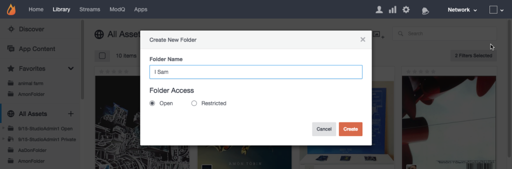

# アセットフォルダを作成{#create-asset-folders}

フォルダを作成してアセットを整理します。

新しいフォルダを作成すると、すべてのアセットリストにアルファベット順に追加されます。サブフォルダを追加するには、まずフォルダを選択し、ページ上部の **[!UICONTROL Create New Subfolder]** アイコンをクリックします。

1. ツリービュー **[!UICONTROL Create new folder]** からクリックし、名前を入力して、 **[!UICONTROL Create]** 「すべてのアセット」の最上位レベルにフォルダーを作成します。
1. フォルダを選択し、ページ上部の **[!UICONTROL Create New Subfolder]** アイコンをクリックしてサブフォルダを追加します。
1. ダイアログから **[!UICONTROL Add to folder > Select folder]** アセットライブラリにコンテンツを追加するときに、新しいフォルダを作成します。
