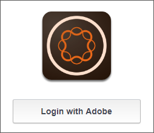
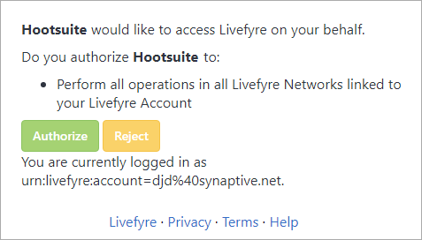
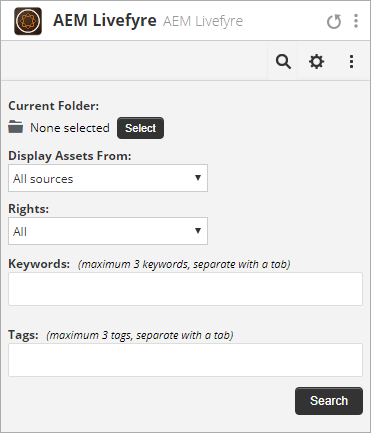
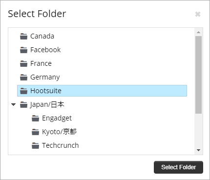
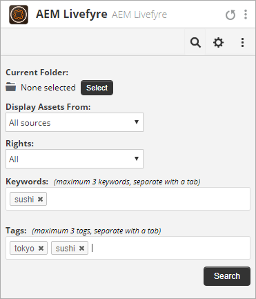
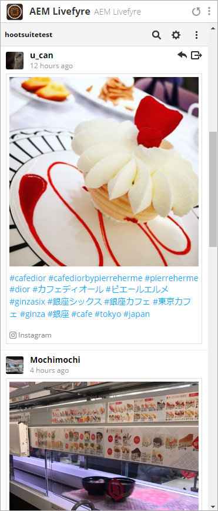
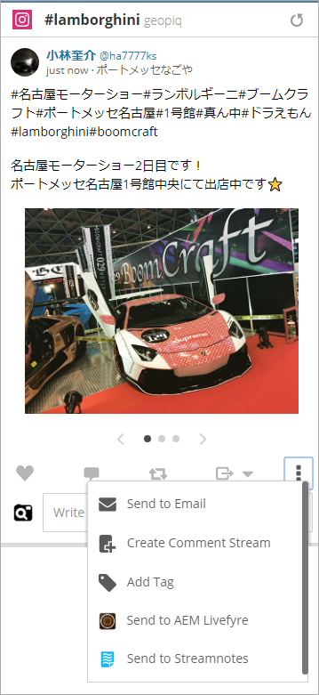
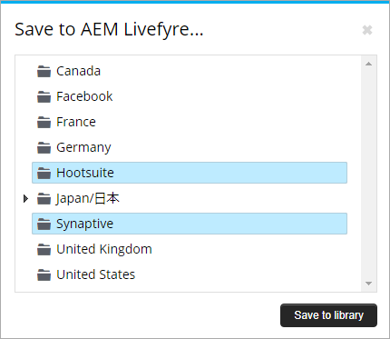
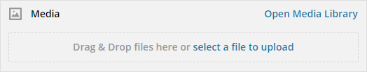
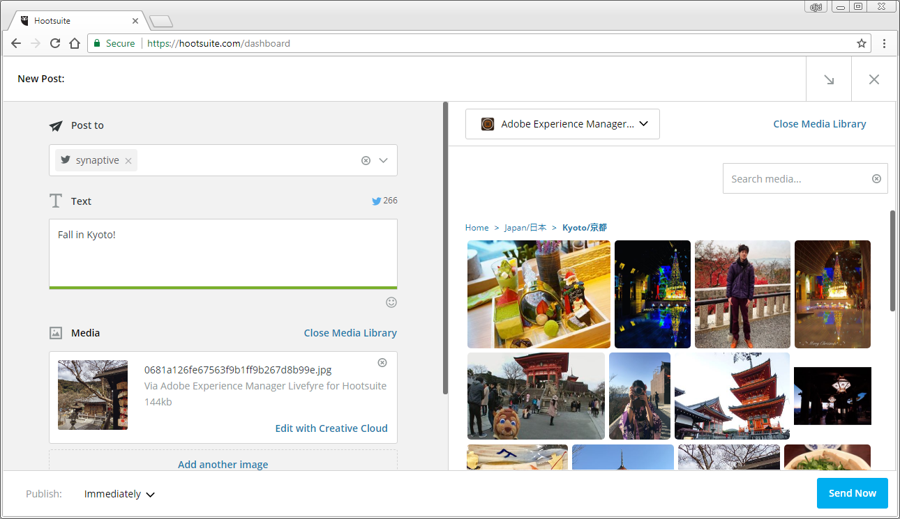

# HootusiteでAdobe Experience ManagerLivefyreを使用{#use-adobe-experience-manager-livefyre-with-hootsuite}

Experience ManagerLivefyreをHootusiteと共に使用し、ユーザー生成コンテンツをHootusiteダッシュボードから直接キュレーション、管理および共有する方法について説明します。

## HootusiteでAdobe Experience ManagerLivefyreを使用{#topic_FB6E613DBCF74F39ABD5045C501EA326}

Experience ManagerLivefyreをHootusiteと共に使用し、ユーザー生成コンテンツをHootusiteダッシュボードから直接キュレーション、管理および共有する方法について説明します。

## はじめに {#task_22699BD901C24384AB2DC02D926D8F4A}

タスクコンテキスト

1. Hootusite App Directoryから、Livefyre for Hootusiteをインストールします。

1. HootSiteダッシュボードで、**Adobeでログイン**&#x200B;をクリックします。

   

1. Livefyreの資格情報を使用してExperience ManagerLivefyreにログインします。
1. 「**許可**」をクリックして、Hootuiteにライブラリへのアクセス権を与えます。

   

   権限を付与すると、Livefyreライブラリ内のアセットを検索できるHootuiteダッシュボードに戻ります。

## アセットを検索する {#task_0B011B0C539E400BB72A6DF69FBF66C0}

タスクコンテキスト

1. メニューバーの検索アイコンをクリックして、Experience ManagerーのLivefyreライブラリ内のアセットを検索します。

   

1. 「**選択**」をクリックすると、すべてのライブラリと共にポップアップが表示されます。
1. ライブラリのフォルダーをクリックし、「**フォルダーを選択**」をクリックして、Hootsuiteストリームに表示するライブラリを選択します。

   

## フィルターオプション {#concept_5D062A9CD61A4B2E90784E5AA31CB16D}

「アセットの表示元」、「権限」、「キーワード」および「タグ」セクションを使用して、検索結果をフィルタリングできます。

次のフィルターオプションがあります。

| セクション | 説明 |
|--- |--- |
| アセットの表示元 | 「すべてのソース」または1つの個別のソースからアセットを表示する場合に選択します。 次に例を示します。Instagram、Twitter、Facebookなど |
| 権限 | 特定の権限設定を持つアセットのみを表示する場合に選択します。 |
| キーワード | キーワードまたはタグで結果をフィルターする場合に選択します。 キーワードでフィルタリングすると、投稿のテキストコンテンツと、発言者の表示名、発言者のユーザー名が検索されます。 |
| タグ | キーワードまたはタグで結果をフィルターする場合に選択します。 キーワードでフィルタリングすると、投稿のテキストコンテンツと、発言者の表示名、発言者のユーザー名が検索されます。 |

検索パラメーターを選択すると、検索時にアセットがストリーム内に表示されます。

### ストリームメニューのオプション

ユーザーの名前またはアイコンをクリックすると、そのユーザーが各ネットワーク上に表示されます。 時間をクリックすると、元の記事が表示されます。 マウスをアイテムの上に移動すると、その他のオプションが表示されます。 共有をクリック

アイコンをクリックすると、現在のアセットが「ネットワーク構成」ボックスに追加され、Hootsuiteを介してネットワークと共有できます。

>[!NOTE]
>
>共有ボタンは、権限が付与されたアセットをフィルタリングしている場合にのみ表示されます。

「を割り当て」アイコンをクリックして、現在のアイテムをHootsuiteチームのメンバーの1人に割り当てます。 項目が既に割り当てられている場合は、解決

アイコンが表示されます。 クリックすると、現在の割り当てを解決できます。

### その他のアプリメニュー

設定をクリック

アイコンを使用すると、現在のExperience ManagerのLivefyreアカウントを切断し、別のアカウントと接続できます。

メニューをクリック

アイコンに、このドキュメント、サポート、およびSnaptiveのWebサイトのリンクが表示されます。

## Experience ManagerLivefyre App Plugin {#task_33C8CEF4F5E44830B970BB3A7AAA2AA6}

アセットライブラリをHootuiteストリームに表示できるだけでなく、Instagram、Twitter、Facebook、YouTubeの各ストリームの項目をExperience ManagerのLivefyreライブラリに保存することもできます。

1. 各アイテムの下部にあるメニューアイコンをクリックします。

   

1. 「**AEM Livefyreに送信**」を選択します。
1. アセットの保存先の1つ以上のライブラリを選択します。

   

1. 「**ライブラリに保存**」をクリックすると、選択したライブラリにアイテムが保存されます。

## Experience ManagerLivefyreMedia Libraryコンポーネント{#task_9CA2D5D49F8E463F9EF475BC09C8ACC9}

Hootsuite Composerのメディアコンポーネントを使用して、アセットにアクセスできます。

1. Composerで、「**メディア**」セクションの「**Media Libraryを開く**」リンクをクリックします。

   

1. ドロップダウンメニューから「Adobe Experience ManagerLivefyre」を選択すると、ファイルが表示されます。

   

1. 書き込んでいる現在の投稿にアセットを追加するには、そのアセットをクリックします。 特定のアセットを検索するには、「**メディアを検索**」ボックスに検索語句を入力します。検索結果が表示されます。
