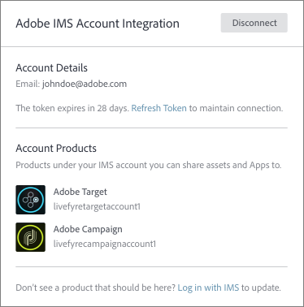
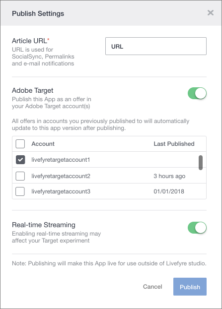

# Adobe Experience Manager LivefyreとAdobe targetの連携 {#livefyre-target}

Adobe targetとLivefyreを統合すると、LivefyreアプリをTargetオファーライブラリと直接共有できます。

## LivefyreインスタンスとTargetの接続 {#connect-livefyre-target}

ユーザー設定でAdobe IMSアカウントをリンクして、LivefyreインスタンスをAdobe targetに接続します。

1. Livefyre studioで、タブをクリックし **[!UICONTROL Users]** ます。

1. IMSアカウント統合を使用してTargetに接続するユーザーアカウントを選択します。

1. Click **[!UICONTROL Connect]**.

1. IMS資格情報を入力します。

Adobe IMSアカウントがAdobe IMS統合ウィンドウに表示するためのアクセス権を持つ製品インスタンス。

これで、LivefyreインスタンスがAdobe targetに接続されました。

## Adobe targetとのLivefyreアプリの共有 {#share-livefyre-target}

Livefyre studioで作成したアプリをAdobe targetと直接共有します。

1. Livefyre studioで、タブをクリックし **[!UICONTROL Apps]** ます。

1. Adobe targetと共有するアプリを選択します。

1. Click **[!UICONTROL Publish]**.

1. 「公開設定」で、Adobe targetスイッチをクリックします。

ターゲットインスタンスのリストが表示されます。

1. アプリを共有するTargetインスタンスを選択します。

1. Click  **[!UICONTROL Publish]**.

LivefyreアプリがTargetオファーライブラリで使用できるようになりました。 アプリの公開について詳しくは、Targetドキュメントの [「コンテンツとオファ](/help/using/c-library/t-publish-content.md) ーの公開  」を参照してください。