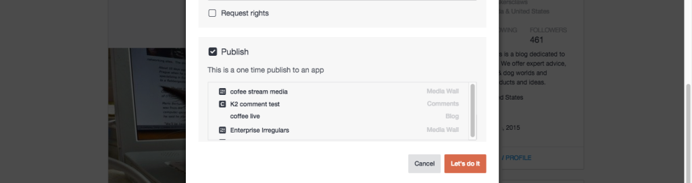

# コンテンツを公開{#publish-content}

アプリに直接コンテンツを投稿します。

アプリに直接公開されたコンテンツは、アセットライブラリに保存されません。

1. **[!UICONTROL View Details]** を参照してください。
1. ダイアログから **[!UICONTROL Publish]** チェックボックスを選択 **[!UICONTROL Advanced Options]** します。
1. アイテムの投稿先のアプリを選択します。
1. Click **[!UICONTROL Let’s do it]**.
