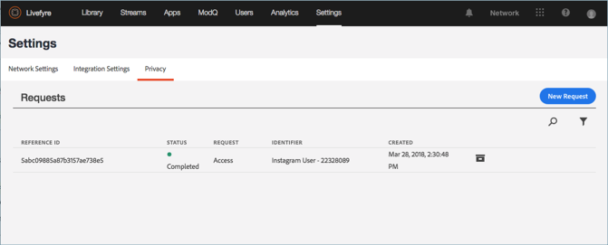
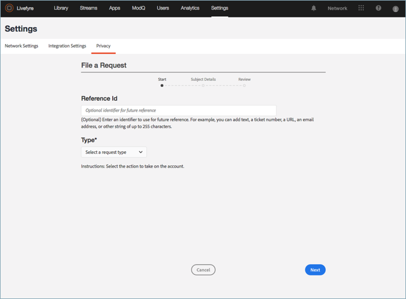
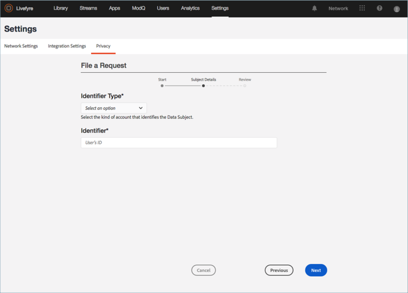
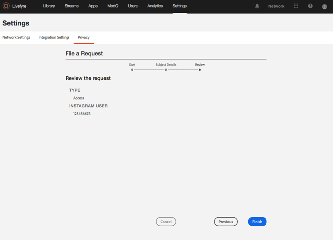

# プライバシーリクエストの作成{#create-a-privacy-request}

Livefyreでプライバシーリクエストを作成します。

ユーザーのすべてのデータを削除し、ユーザーのすべてのデータのレポートを生成し、このプロセスを使用してオプトインまたはオプトアウトの変更を行います。

ユーザーを検索して検索し、そのコンテンツのレポートを生成するには:

1. 先 **[!UICONTROL Settings > Privacy]** に移動して、をクリック **[!UICONTROL Create Request]** します。

   

1. **[!UICONTROL Submit Request]** ウィンドウ内の情報を入力します。

   * **[!UICONTROL Reference Id]**. 将来の参照に使用する識別子を入力します。例えば、テキスト、チケット番号、URL、電子メールアドレス、その他255文字までの文字列を追加できます
   * **[!UICONTROL Type]** 

      * **アクセス**。アカウントに関連付けられているすべての使用可能なデータを収集します。機密性やソーシャル資格情報などの機密性の詳細は、不明化または省略されます。

      * **削除**します。アカウントに関連付けられているすべてのデータをセグメント化または不明化します。**このオプションを選択して「送信」をクリックすると、このアクションを逆またはキャンセルしたり、削除*したデータを元に戻すことはできません。*** アカウントがLivefyre Studioユーザーに属している場合、ビジネスレコードの整合性を維持するために一部のデータが保持されます。

         >[!IMPORTANT]
         >
         >アカウントのデータを削除すると、そのアカウントに関連付けられているデータが完全に削除または破棄されます。このアクションを元に戻したり、削除した後でデータを復元したりすることはできません。

      * **オプトアウト**。ストリームまたはソーシャル検索を通じて、ソーシャルアカウントからのデータまたはコンテンツをLivefyreが受動的に収集できないようにします。オプトインおよびオプトアウトは、登録ユーザーには適用されません
      * **オプトイン**。Livefyreが、以前ストリームまたはSocial検索経由でオプトアウトされているソーシャルアカウントから、受動的にデータまたはコンテンツを収集できるようにします。オプトインおよびオプトアウトは、登録ユーザーには適用されません
      

   * **[!UICONTROL Identifier Type]** および **[!UICONTROL Identifier]** 

      * **[!UICONTROL User Account]** 

         * ユーザー管理システムまたはLivefyreのStudio User識別子によって生成されたユーザーアカウントIDによって、登録ユーザーのアカウントを識別します。**Livefyre****ユーザー設定また** は **アセットライブラリ** また **はアプリケーションコンテンツのコンテンツの詳細について、Livefyreユーザー設定のユーザーのユーザーアカウントIDを見つけることもできます**

         * 許可されている値:英数字255文字までの英数字。電子メールアドレスが有効な入力ではありません
      * **[!UICONTROL Facebook User]** 

         * Facebookが提供する数値のIDによってアカウントを識別します。要求者はこれを提供する必要があります。数字Facebook ID [の検索方法については、](https://www.facebook.com/help/1397933243846983?helpref=faq_content)
         * 許可されている値:6~16文字
      * **[!UICONTROL Instagram User]** 

         * Instagramが提供する数値のIDでアカウントを識別します。要求者はこれを提供する必要があります。オンライン検索によってInstagramアカウントで数値Instagram IDを見つける方法について説明します
         * 許可されている値:5~16文字
      * **[!UICONTROL Twitter User]** 

         * Twitterによって提供される数値のIDでアカウントを識別します。プライバシーの変更を要求するユーザーは、これを提供する必要があります。オンライン検索によってTwitterアカウントの数値Twitter IDを見つける方法について説明します
         * 許可されている値:5~16文字
      * **[!UICONTROL YouTube User]** 

         * YouTubeによって提供される数値のIDによってアカウントを識別します。プライバシーの変更を要求するユーザーは、これを提供する必要があります。YouTubeアカウントで数値のYouTube IDを検索する方法については、ここを参照して [ください](https://support.google.com/youtube/answer/3250431?hl=en)
         * 許可されている値:5~16文字
      * **[!UICONTROL Generic Author]** 

         * Livefyre Author ID（JID）によってアカウントを識別します。このオプションは、RSS、TumblrまたはURLを使用しているコンテンツに使用します。このIDを検索するには **、アプリコンテンツ** または **アセットライブラリ**で作成者に帰属するコンテンツを検索し、アイテムを選択します。IDは ******、情報また** は詳細セクションの作成者の下の **アセットライブラリ** で **、「情報** 」の下に **** あります

         * 許可されている値:最大255文字の英数字文字列
         

1. **[!UICONTROL Finish]** をクリックします。

   

1. （リクエストの削除の場合のみ）ユーザーのすべての情報を削除することを確認します。

   >[!IMPORTANT]
   >
   >アカウントのデータを削除すると、そのアカウントに関連付けられているデータが完全に削除または破棄されます。このアクションを元に戻したり、削除した後でデータを復元したりすることはできません。

