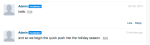
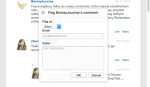

# 文字列のローカライズ{#localize-strings}

Livefyreアプリの文字列のカスタマイズを参照してください。

Livefyre app内のほとんどのHTML要素のテキスト文字列は、カスタマイズできます。 これにより、「Post As」ボタン、「Comment Count」テキスト、「Sign In」ボタンなど、レンダリングされたHTML要素のテキストを、有効なUTF-8文字列に柔軟に変更できます。 この機能を使用して、ストリームの実装に個人情報を追加したり、アプリ内の言語をユーザーベース用にローカライズしたりします。

* コメント、チャット、ライブブログ

   * [実装](#c-localize-strings/section_im4_224_xz)
   * [アカウントアクセス](#c-localize-strings/section_cm3_d24_xz)
   * [ストリーム情報](#c-localize-strings/section_wx1_c24_xz)
   * [ストリームの並べ替え](#c-localize-strings/section_ih2_124_xz)
   * [コンテンツ情報](#c-localize-strings/section_llv_yd4_xz)
   * [重点コンテンツ](#c-localize-strings/section_gmw_vd4_xz)
   * [テキストエディター](#c-localize-strings/section_ky5_td4_xz)
   * [回答オプション](#c-localize-strings/section_zvt_qd4_xz)
   * [コメント通知](#c-localize-strings/section_qqt_pd4_xz)
   * [エラーメッセージ](#c-localize-strings/section_omz_jxn_xz)

* [時間と日付の形式](#c-localize-strings/section_yz4_g5n_xz)
* [メディアウォール](#c-localize-strings/section_vwt_d5n_xz)
* [マップ](#c-localize-strings/section_fxv_c5n_xz)
* [モザイク](#c-localize-strings/section_e2s_b5n_xz)
* [カルーセル](#c-localize-strings/section_l2z_hkn_xz)
* [機能カード](#c-localize-strings/section_mw2_hkn_xz)
* [投票](#c-localize-strings/section_pdg_fwh_xz)
* [Livefyre ID](#c-localize-strings/section_zc3_xvh_xz)
* 詳細情報:
   * [テキスト文字列の確認](/help/using/c-settings-other/c-translation-sets/c-review-text-strings.md#c_review_text_strings)
   * [サイデン](/help/using/c-settings-other/c-translation-sets/c-sidenotes-text-strings.md#c_sidenotes_text_strings)

## 実装 {#section_im4_224_xz}

この機能を実装するには、上書きする文字列の1 ～ 1個のオブジェクトマッピングをJavaScript設定オブジェクトに渡します。 フィールドを指定しない場合は、デフォルトのテキストが使用されます。

例：

```
var customStrings = {     
   postAsButton: "New Post As Text",     
   postEditButton: "New Post Edit Text"  
};   
   convConfig["strings"] = customStrings; fyre.conv.load(     
   networkConfig,     
   [convConfig],     
   function(){}  
);
```

このページには、Livefyreコアアプリ用にカスタマイズできるすべてのテキスト文字列が一覧表示されます。

## アカウントアクセス {#section_cm3_d24_xz}

認証プロセスで使用できる文字列、および認証済みユーザーメニューから使用できます。


| 要素 | キー | デフォルトのテキスト |
|---|---|---|
|  | displayName | %s |
|  | editProfile | プロファイルの編集 |
|  | notificationSettings | 通知設定 |
|  | siteAdmin | 管理コンソール（Studioへのリンク） |
|  | signOut | サインアウト |

## ストリーム情報 {#section_wx1_c24_xz}

コンテンツストリーム情報および表示に使用できる文字列。 リスニングしている人の数、アプリへの投稿数、ユーザーがログインしたり、アカウント情報にアクセスしたりできるようにします。

| キー | デフォルトのテキスト | ストリームデータ |
|---|---|---|
|  | commentCountLabelZero | %sコメント |
|  | commentCountLabel | %sコメント |
|  | commentCountLabelPlural | %sコメント |
|  | listenerCount | 聞く人 |
|  | listenerCountPlural | 聞く人 |
|  | liveblogPostCountLabelZero | 投稿 |
|  | liveblogPostCountLabel | 投稿 |
|  | liveblogPostCountLabelPlural | 件の投稿 |
| ねじオプション | threadBreakoutButton | スレッド全体を表示 |
|  | toggleCollapse | 折りたたみの切り替え |
| 高速度/キューに登録されたコメント | refresh | 更新 |
|  | newComment | 新しいコメント |
|  | newComments | 新しいコメント |
|  | newReply | 新しい返信 |
|  | newReplies | 新しい返信 |

## ストリームの並べ替え {#section_ih2_124_xz}

年齢や人気度で返されたコンテンツを並べ替えることができます。


| キー | デフォルトのテキスト | ヘッダーオプション |
|---|---|---|
|  | sortNewest | 新しい順 |
|  | sortOldest | 古い順 |
|  | sortTopComments | 上位のコメント |
|  | sortHotThreads | ホットスレッド |
|  | sortSeparator |  |  |
|  | streamSorting | ロードしています |
|  | topCommentsContentNotFoundMsg | まだ好きじゃ足りない。 |
|  | hotThreadsContentNotFoundMsg | まだスレッド数が足りません。 |
|  | streamRefreshMsg | 新機能を確認します。 |
| フッターオプション | archiveHeaderTitle | アーカイブから |
|  | archiveShowMore | 詳細を表示 |
|  | showMore | 他のコメントを表示 |
|  | showMoreLiveblog | 他の投稿を表示 |


## コンテンツ情報 {#section_llv_yd4_xz}

投稿情報を表示します。ユーザー名、適用されたユーザータグおよび投稿時間。

  

| キー | デフォルトのテキスト | 作成者 |
|---|---|---|
|  | 司会者 | 司会者 |
|  | hovercardViewProfile | フルプロファイルを表示 |
| 投稿情報 | timeJustNow | 今現在 |
|  | timeMinutesAgo | 分前 |
|  | timeMinutesAgoPlural | 分前 |
|  | timeHoursAgo | 時間前 |
|  | timeHoursAgoPlural | 時間前 |
|  | timeDaysAgo | 日前 |
|  | timeDaysAgoPlural | 日前 |
|  | likesPlural | いいね！ |
|  | likesSingular | いいね！ |
|  | moderatorEditTimestamp | モデレーターによる編集 |
|  | commentTombstone | このコメントは削除されました |
|  | permalinkNotFoundMsg | このコメントは表示されなくなりました。 |
|  | quickProfileTooltip | クイックプロファイル |

## 重点コンテンツ {#section_gmw_vd4_xz}

有効にすると、重点コンテンツがストリームの先頭に表示されます。

|  | キー | デフォルトのテキスト |
|---|---|---|
| 重点ラベル |  |  |
|  | featuredCommentsTag | おすすめ |
|  | featuredCommentsTitlePlural | おすすめコメント |

## テキストエディター {#section_ky5_td4_xz}

デフォルトでは、すべてのユーザーがページの上部に表示されます。


|  | キー | デフォルトのテキスト |
|---|---|---| 
| エディターボタン | フォロー | + フォロー |
|  | 追跡しない |  — フォロー解除 |
|  | liveblogFollow | ライブブログをフォロー |
|  | liveblogUnfollow | ライブブログのフォロー解除 |
|  | postButton（ログインしたユーザーが使用できます） | コメントを投稿 |
|  | postAsButton（未認証ユーザーに対して使用可能） | 次の形式でコメントを投稿… |
|  | postEditButton | コメントの編集 |
|  | postEditAsButton | コメントの編集… |
|  | postEditCancelButton | キャンセル |
|  | editorDisabled | この会話は現在、新しいコメントに対して閉じられています。 |
| チャットオプション | livechatPostButtonLabel | 投稿 |
|  | livechatPostEditButton | 編集 |
|  | livechatWindowsInstruction | Ctrl + enterキーを押して投稿 |
|  | livechatOtherInstruction | Command + enterキーを押して投稿 |

## 回答オプション {#section_zvt_qd4_xz}

特に断りのない限り、ログインしているすべてのユーザーが使用できます。 コンテンツパネルにマウスを移動してアクセスします。


| キー | デフォルトのテキスト |  |
|---|---|---|
| ユーザー応答オプション | エンドユーザーが使用できます。 |  |
| flagButton | Flag |
|  | flagCommentTooltip | Flag |
|  | editButton（有効な場合、作成者およびモデレーターに対してのみ使用可能） | 編集 |
|  | deleteButton（有効な場合、作成者およびモデレーターに対してのみ使用可能） | 削除 |
|  | deleteCommentTooltip | 削除 |
|  | shareButton | 共有 |
|  | shareCommentTooltip | 共有 |
|  | likeButton | いいね！ |
|  | inlikeButton | 「いいね！」を取り消す |
|  | replyButton | 返信 |
|  | replyButtonSingular（ChatおよびLive Blogで利用可能） | 返信 |
|  | replyButtonPlural（ChatおよびLive Blogで利用可能） | 返信 |


| キー | デフォルトのテキスト |  |
|---|---|---|
| フラグモーダル | flagTitle | フラグ%sのコメント |
|  | flagSubtitle | フラグの設定 |
|  | flagDefaultSelectOption | 選択 |
|  | flagSpam | スパム |
|  | flagSpamButton | スパム |
|  | flagSpamCommentTooltip | スパム |
|  | flagOffense | 不快な |
|  | flagOffenseButton | 不快な |
|  | flagOffenseCommentTooltip | 不快な |
|  | flagDisagree | 同意しない |
|  | flagDisagreeButton | 同意しない |
|  | flagDisagreeCommentTooltip | 同意しない |
|  | flagOffTopic | トピック外 |
|  | flagOfftopicButton | トピック外 |
|  | flagOfftopicCommentTooltip | トピック外 |
|  | flagEmail | 電子メール |
|  | flagEmailPlaceholder | you@example.com |
|  | flagNotes | メモ |
|  | flagNotesPlaceholder | ここに入力します… |
|  | flagConfirmButton | OK |
|  | flagCancelButton | キャンセル |
|  | flagConfirmationMessage | %sのコメントに%sのフラグを付けますか？ |
|  | flagSuccessMsg | コメントにフラグが付けられました。 |



| キー | デフォルトのテキスト |  |
|---|---|---|
| 共有モーダル | shareTitle | コメントを共有 |
|  | sharePlaceholderText | どう思う？ |
|  | shareLabel | 共有する場所： |
|  | shareTextTwitter | 空白 |
|  | shareTextFacebook | 空白 |
|  | shareTextLinkedin | 空白 |
|  | shareButtonText | 共有 |
|  | sharePermalink | パーマリンク |
|  | loadingPermalink | 短いURLを読み込んでいます… |
|  | shareText | 私はコメントを投稿しました。 見ろ！ |


| キー | デフォルトのテキスト |  |
|---|---|---|
| 返信モーダル | postReplyAsButton | 次の形式でコメントを投稿… |
|  | postReplyButton（ログインしたユーザーが使用できます） | コメントを投稿 |
|  | backToHotThreads | ホットスレッドに戻る |


| キー | デフォルトのテキスト |  |
|---|---|---|
| Twitter @メンションモーダル | mentionTitle | メンションを共有 |
|  | mentionSubtitleTwitter | ツイートの共有先： |
|  | mentionDefaultText | ライブフィレのコメントで言った！ |
|  | mentionConfirmButton | OK |
|  | mentionCancelButton | キャンセル |
|  | mentionErrorGeneral | おっと！ 何か問題が発生しました！ Livefyreが警告を受けました。 |
|  | mentionErrorNoneSelected | 少なくとも1つのメンションを有効にする必要があります。 |
|  | mentionMenuTitle | 友人に会ってメンションするには |
|  | mentionTwitterConnect | Twitterに接続 |
|  | mentionTwitterFetching | 友達を取得中… |
|  | mentionSuccessMsg | メンションが正常に送信されました。 |


| キー | デフォルトのテキスト |  |
|---|---|---|
| モーダルの編集 | Studio管理者、ユーザーマネージャーまたはモデレーターが使用可能 |  |
| @(@mention.) | &lt;/&gt;（カスタムHTMLウィンドウを開きます。） |  |
|  | customHtmlDialogTitle（モーダルのヘッダーとして表示されます） | カスタムHTMLの追加 |


| キー | デフォルトのテキスト |  |
|---|---|---|
| モデレーターの応答オプション | Studio管理者、ユーザーマネージャーまたはモデレーターが使用できます。 |  |
| pendingComment | pending |
|  | banUserButton | ユーザーの禁止 |
|  | banUserTooltip | ユーザーの禁止 |
|  | bozoButton | 坊蔵 |
|  | bozoCommentTooltip | 坊蔵 |
|  | featureButton | 機能 |
|  | featureCommentTooltip | 機能 |
|  | unfeatureButton | 機能解除 |
|  | featuredCommentTooltip | 機能解除 |


| キー | デフォルトのテキスト |  |
|---|---|---|
| ユーザーモーダルの禁止 | Studio管理者、ユーザーマネージャーまたはモデレーターが使用できます。 |  |
| banTitle | ユーザーの禁止 |  |
|  | banConfirmation | このユーザーを禁止しますか？ |
|  | banConfirmButton | OK |
|  | banCancelButton | キャンセル |

## コメント通知 {#section_qqt_pd4_xz}

有効になっている場合は、ページの下部で、すべてのLivefyre会話アプリで使用できます。


|  | キー | デフォルトのテキスト |
|---|---|---|
| 通知者のラベル | commentNotifier | 新しいコメント |
|  | commentNotifierPlural | 新しいコメント |
|  | liveblogNotifier | 新しい投稿 |
|  | liveblogNotifierPlural | 新しい投稿 |

## エラーメッセージ {#section_omz_jxn_xz}

カスタマイズ可能なエラーメッセージに使用できる文字列。

| キー | デフォルトのテキスト |
|---|---|
| errorAuthError | この会話にコメントを投稿する権限がありません |
| errorCommentsNotAllowed | この会話に対するコメントは許可されていません |
| errorDefault | エラーが発生しました. もう一度お試しください。 |
| errorDuplicate | コメントを2回投稿することはできません。 |
| errorEditDuplicate | コメントの本文は、編集時に変更する必要があります。 |
| errorEditNotAllowed | この会話に対するコメントを編集することはできません。 |
| errorEditTimeExceeded | 申し訳ございません。コメント編集期間が終了しました。 |
| errorEmpty | 空のコメントを投稿しようとしている可能性があります。 |
| errorExpired | セッションの有効期限が切れました。 ページを再読み込みしてください。 |
| errorFlagNotSelected | フラグの種類を選択してください。 |
| errorGuestLinked | 申し訳ございませんが、アカウントを持つユーザーのみがコンテンツを好きになれます。 |
| errorInsufficientPermissions | 権限が不十分 |
| errorInvalidChar | 無効な文字を投稿しようとしている可能性があります。 |
| errorLikeOwnComment | 自分のコメントを気に入ることはできません |
| errorMalformed | 不正な形式のコンテンツを投稿しようとしている可能性があります。 |
| errorMaxChars | 申し訳ございません。コメントが長すぎます。 編集して、もう一度お試しください。 |
| errorMediaNotAvailable | メディアは表示されなくなりました。 |
| errorShowMore | 追加のコメントの読み込み中にエラーが発生しました。 |
| MultipleMediaNotAllowedError | 権限によって付与されるメディア添付ファイルは一度に1つだけです。 |

## 時間と日付の形式 {#section_yz4_g5n_xz}

ビジュアライゼーションアプリ内のコンテンツカードでの日付の表示方法を翻訳し、カスタマイズします。

| キー | デフォルトのテキスト |
|---|---|
| hoursAgo | {number}時間 |
| hoursAgoSingular | {number}時間 |
| justNow | 1 |
| minutesAgo | {number}m |
| minutesAgoSingular | {number}m |
| monthDayFormat | {day} {monthAbbrev} |
| monthDayYearFormat | {day} {monthAbbrev} {year} |
| monthNames | 1 月、2 月、3 月、4 月、5 月、6 月、7 月、8 月、9 月、10 月、11 月、12 月 |
| monthNamesAbbrev | Jan、Feb、Mar、Apr、May、Jun、Jul、Aug、Sep、Oct、Nov、Dec |
| secondsAgo | {number}秒 |
| secondsAgoSingular | {number}秒 |

## メディアウォール {#section_vwt_d5n_xz}

Media wallアプリで使用できる文字列。

| キー | デフォルトのテキスト |
|---|---|
| featuredText | おすすめ |
| shareButtonText | 共有 |

| キー | デフォルトのテキスト |
|---|---|
| postButtonText | 何を考えているの？ |
| postModalTitle | コメントの投稿 |
| postModalButton | コメントの投稿 |
| postModalPlaceholder | 何を言いたいの？ |
| showMoreButtonText | さらにロード |
| shareButtonText | 共有 |

## マップ {#section_fxv_c5n_xz}

マップで使用できる文字列。

| キー | デフォルトのテキスト |
|---|---|
| featuredText | おすすめ |
| shareButtonText | 共有 |

## モザイク {#section_e2s_b5n_xz}

モザイクで使用できる文字列。

| キー | デフォルトのテキスト |
|---|---|
| featuredText | おすすめ |
| shareButtonText | 共有 |

## カルーセル {#section_l2z_hkn_xz}

カルーセルで使用できる文字列です。

| キー | デフォルトのテキスト |
|---|---|
| featuredText | おすすめ |
| shareButtonText | 共有 |

## 機能カード {#section_mw2_hkn_xz}

フィーチャーカードで使用できる文字列。

| キー | デフォルトのテキスト |
|---|---|
| featuredText | おすすめ |
| shareButtonText | 共有 |

## アプリのアップロード {#section_grc_gkn_xz}

アプリのアップロードで使用できる文字列。

| キー | デフォルトのテキスト |
|---|---|
| postButtonText | 何を考えているの？ |
| postModalTitle | コメントの投稿 |
| postModalButton | コメントの投稿 |
| postModalTitlePlaceholder | タイトルを入力 |
| postModalPlaceholder | 何を言いたいの？ |
| postModalConfirationTitle | 投稿してくれてありがとう！ |
| postModalConfirmationMessage | 投稿をレビュー中です。 |
| postModalConfirmationButton | 完了 |
| title |  |
| message |  |
| editorErrorAttachmentsRequired | 添付ファイルが必要です |
| editorErrorBody | メッセージを追加してください |
| editorErrorDuplicate | メモを好きなだけ2回投稿することはできません |
| editorErrorGeneric | エラーが発生しました |
| editorErrorTitleRequired | タイトルが必要です |

## 投票 {#section_pdg_fwh_xz}

投票で使用できる文字列です。

| キー | デフォルトのテキスト |
|---|---|
| totalVotesLabel | %s票 |
| shareStringText | 私は%sに投票しましたが、あなたの投票は何ですか？ |
| pollClosedLabel | このポールは現在閉じられています |

## Livefyre ID {#section_zc3_xvh_xz}

Livefyre idで使用できる文字列です。

| キー | デフォルトのテキスト |
|--- |--- |
| automaticallyFollowConversations | 自動的に会話に従う |
| back | 戻る |
| 生物学的 | プロフィール |
| create | 次に、 |
| createANewAccount | 新規アカウントの作成 |
| createNewAccountWithEmail | 電子メールを使用して新しいアカウントを作成する |
| changeAvatar | アバターの変更 |
| chooseFile | ファイルを選択 |
| completeAccount | 完全なアカウント |
| emailWhenSomeoneReplies | 返信時に電子メールを送信する |
| emailCommentsIFollow | フォロー中の会話のコメントを電子メールで送信する |
| emailSenttoResetPassword | 電子メールが送信されました。 受信トレイでパスワードをリセットするためのリンクを確認してください |
| emailVerificationSent | 電子メールの検証が送信されました |
| firstName | 名 |
| forgotPassword | パスワードを忘れた場合 |
| forgotYourPassword | パスワードを忘れた？ |
| forgotYourPasswordInstructions | ユーザー名または電子メールアドレスを下に入力し、パスワードを変更するためのリンクをお送りします。 |
| formInputCloseButtonText | Close |
| formInputCancelButtonText | キャンセル |
| formInputSaveButtonText | 保存 |
| hasNotLeftAnyComments | 何のコメントも残されていない |
| locationIsFrom |  は ～ の番号）という名前の 5 つのプレースホルダがあります。 |
| labelAvatar | アバター |
| labelComments | コメント |
| labelConfirmNewPassword | 新しいパスワードの確認 |
| labelConfirmPassword | パスワードを確認 |
| labelEmail | Email Address |
| labelLikes | いいね！ |
| labelLoading | ロードしています |
| labelNewPassword | 新しいパスワード |
| labelNotification | 通知 |
| labelPassword | Password |
| labelProfile | プロファイル |
| labelUsername | Username |
| labelUsernameOrEmail | ユーザー名または電子メール |
| lastName | 姓 |
| livefyreAccount | Livefyreアカウント |
| ロケーション | 場所 |
| loadingProfile | プロファイルの読み込み中 |
| newPassword | 新しいパスワード |
| oldPassword | 古いパスワード |
| on | on |
|  または |  または |
| passwordLinkExpired | パスワードをリセットするためにクリックしたリンクの有効期限が切れました。 パスワードを再度リセットすると、新しいリンクが送信されます。 |
| pleasecheckEmailToComplete | 登録を完了するには、電子メールを確認してください。 |
| 投稿済み | 投稿済み |
| poweredBy | ～で動く |
| profileNotificationImmediate | immediate |
| profileNotificationHourly | 時間 |
| profileNotificationNever | never |
| recentComments | 最近のコメント |
| reset | Reset |
| resetPassword | パスワードのリセット |
| signIn | サインイン |
| signInWith | サインイン |
| signInWithEmail | 電子メールでサインイン |
| signUp | 入会 |
| socialAccount | Socialアカウント |
| successPasswordChanged | 成功! パスワードが変更され、ログインしました |
| termsAndConditions | 利用条件 |
| termsAndConditionsIntro | 新規登録すると、 |
| termsOfUse | 利用条件 |
| termsOfUseIntro | ログインすると、 |
| thisUser | このユーザー |
| verifyPassword | パスワードの確認 |
| fileSizeLimit | 最大2 MB |
| accountnotfound | アカウントが見つかりません |
| avatarImageExceedSize | アバター画像がファイル数の上限2 MBを超えています |
| fieldisquired | フィールドは整数のみ受け入れます |
| fieldonlyacceptsavalidemail | 有効な電子メールのみを受け入れるフィールド |
| fieldonlyacceptsletters | フィールドはレターのみ受け入れます |
| filesizemustbelessthanMB | ファイルサイズは {#}MB未満にする必要があります |
| invalidusernameorpassword | 無効なユーザー名またはパスワード |
| 最小長文字 | 最小文字 {#} 長 |
| 最大長文字 | 最大文字 {#} 長 |
| therewanerror | エラーが発生しました |
| このフィールドは必須 | このフィールドは必須です。 |
| validfileextensions | 有効なファイル拡張子 |
| valuemustmatch | 値は一致する必要があります |
| passwordLength | は6 ～ 32文字です。 |
| passwordCharacters | 小文字と大文字の両方を含めます。 |
| passwordSymbols | 少なくとも1つの数字と1つの記号を含めます。 |
| passwordUsername | ユーザー名が含まれていません。 |
| passwordPoverTitle | パスワードは次の必要があります。 |
| passwordErrorContainsFirstName | 入力したパスワードには、ユーザー名、名、姓のいずれかが含まれます。 セキュリティ上の理由から、ユーザ名、名、姓を含まないパスワードを入力してください。 また、パスワードには次の文字を含める必要があります。6 ～ 32文字大文字A小文字A記号 |
| passwordErrorContainsLastName | 入力したパスワードには、ユーザー名、名、姓のいずれかが含まれます。 セキュリティ上の理由から、ユーザ名、名、姓を含まないパスワードを入力してください。 また、パスワードには次の文字を含める必要があります。6 ～ 32文字大文字A小文字A記号 |
| passwordErrorContainsUsername | 入力したパスワードには、ユーザー名、名、姓のいずれかが含まれます。 セキュリティ上の理由から、ユーザ名、名、姓を含まないパスワードを入力してください。 また、パスワードには次の文字を含める必要があります。6 ～ 32文字大文字A小文字A記号 |
| passwordErrorTooShort | パスワードの6文字以上 |
| passwordErrorTooLong | パスワードは最大32文字 |
| passwordErrorMissingUppercase | パスワードには、少なくとも1文字の大文字を含める必要があります |
| passwordErrorMissingLowercase | パスワードには、少なくとも1文字の小文字を含める必要があります |
| passwordErrorMissingSymbol | パスワードには、セット内に少なくとも1つの記号を含める必要があります `!@#$%^&*()?.,<>\’;:”[]{}|` |


