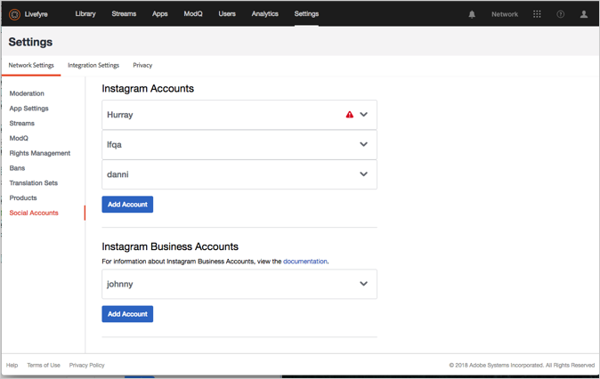
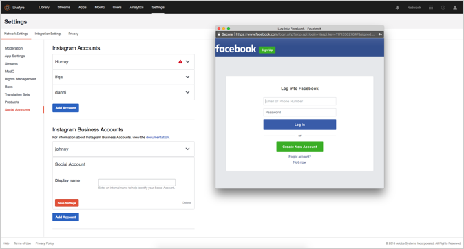

# Socialアカウントの追加{#add-a-social-account}

ストリームまたはソーシャル検索で、権限をリクエストするか、UGCを検索するようにソーシャルアカウントを設定します。

Livefyreは、TwitterおよびInstagram Socialアカウントを使用して、ソーシャル検索（ライブラリ）を実行したり、ストリームを使用したりします。

ライブラリでTwitterソーシャル検索を使用するには、Twitterでアカウントを設定する必要があります。

Instagramのソーシャルアカウントには、Adobe Livefyreの使用方法に応じて異なるルールがあります。Livefyreで使用できるソーシャルアカウントのタイプについて詳しくは、Instagramアカウント [について](/help/using/c-users-creating-accounts-with-studio-access/t-configure-social-accout-instagram/c-about-instagram-accounts.md#c_about_instagram_accounts)を参照してください。

ソーシャルアカウントを設定するには:

1. 次の場所へ移動 **[!UICONTROL Settings >]****[!UICONTROL Network Settings.]**
1. 下 **[!UICONTROL Social Accounts]** のセクションに移動 **[!UICONTROL Network Settings]**します。
1. 追加するソーシャルアカウントのタイプ **[!UICONTROL Add Account]** をクリックします。Livefyreのアカウントを認証するためのダイアログボックスがポップアップ表示されます。

   

   >[!NOTE]
   >
   >Instagramのビジネスアカウントを設定すると、Facebookログイン画面が表示されます。通常どおりログインを続行します。  >

1. クリック **[!UICONTROL Authorize App]** して続行してください。
1. アカウント **[!UICONTROL Display Name]** を追加し、をクリック **[!UICONTROL Save Settings.]**します。アカウント情報ボックスのヘッダー内を **[!UICONTROL Social Account]** クリックして、アカウントを折りたたみます。
