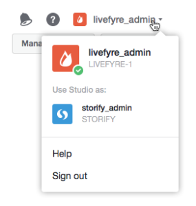

# ユーザーがネットワークを切り替える{#users-switching-networks}

1つのStudioアカウントから複数のネットワークを管理できます。

>[!NOTE]
>
>これは一般的ではありません。

**[!UICONTROL Account]**&#x200B;プルダウンメニューには、現在ログインしているStudioアカウントに関連付けられているすべてのユーザー名と、それらが関連付けられているネットワークがリストされます。 このプルダウンを使用して、管理するネットワークを選択します。

>[!NOTE]
>
>ほとんどのユーザは1つのネットワークに対する権限を持ちますが、Studioの一部のユーザは複数のサイトを所有またはモデレートできます。 Studioアカウントを使用すると、ユーザーは1人のユーザー名とパスワードでログインし、複数のサイトアクセスレベルを切り替えることができます。

