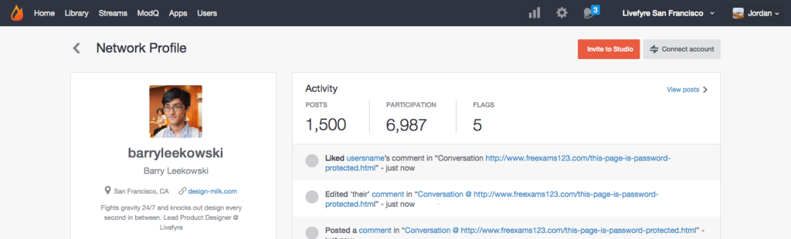

# ユーザーアカウントのリンク{#link-user-accounts}

LivefyreのアカウントをLivefyreアカウントにリンクして、単一の場所からすべてのLivefyreサイトまたはネットワークをモデレートまたは管理します。

>[!NOTE]
>
>Livefyreアプリを操作するには（例えば、コメントを残す、Sideesを追加、コンテンツを共有する）、Studioアカウントのユーザー名とパスワードではなくLivefyreアカウントのユーザー名とパスワードを使用してログインする必要があります。

アカウントをリンクするには:

1. ネットワーク上のLivefyreユーザープロファイルを作成した後、Studioにログインします。
1. に **[!UICONTROL Users]**移動し、ユーザープロファイルを見つけて、ダブルクリックして詳細を表示します。
1. **[!UICONTROL Connect account]**をクリックします。
1. 開くウィンドウで、このアカウントにリンクするユーザーアカウントを選択します。
1. 情報を **[!UICONTROL Link Profile]** 確認し、をクリック **[!UICONTROL Link]**します。 

