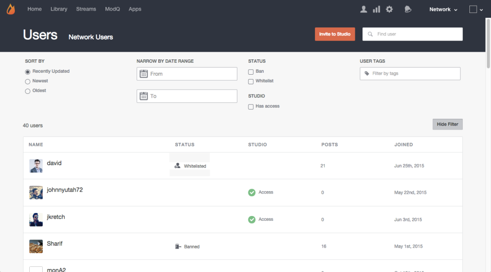

# ユーザーの検索{#search-for-users}

ページ上部の「検索」フィールドを使用して、表示名、ユーザーID、電子メールアドレス、またはLivefyreネットワークに参加した日付でサイト訪問者を検索します。

>[!NOTE]
>
>これらのフィールドは、ワイルドカード検索をサポートしています。

1. **[!UICONTROL Show Filter]**&#x200B;をクリックして、一覧表示されたユーザーをフィルターするパネルを開きます。
1. **[!UICONTROL Sort by]** 表示されるユーザーアカウントの更新：最近の更新、新しい、または古い。
1. **[!UICONTROL Narrow by Date Range]** を、入力範囲内に追加されたユーザーアカウントのみにリストします。
1. リストは&#x200B;**[!UICONTROL Banned]**&#x200B;または&#x200B;**[!UICONTROL Whitelisted]**&#x200B;ユーザーのみです。
1. リストのみ&#x200B;**[!UICONTROL Studio]**&#x200B;ユーザー。
1. 入力&#x200B;**[!UICONTROL User Tags]**&#x200B;が付加されたアカウントのみリスト。

